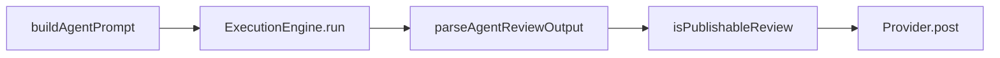
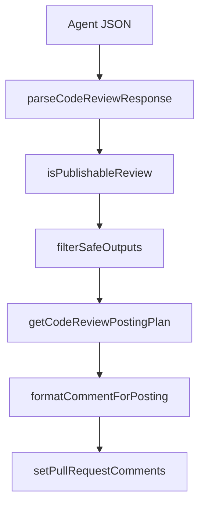
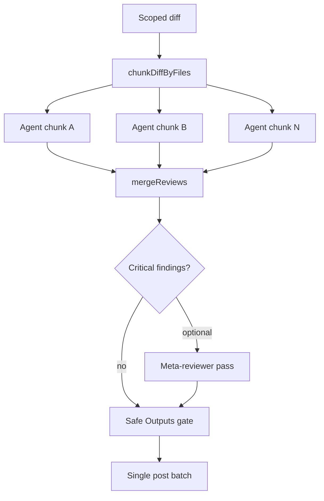

# Agentic Code Reviewer — Architectural Roadmap

## Current baseline

The runner today is **single-agent, single-engine per invocation**:

- Prompt assembly: [`src/agent/prompt.ts`](src/agent/prompt.ts) concatenates `skills/SYSTEM_PROMPT.md`, `skills/CODE_REVIEW.md`, stack file, diff, rules index.
- Publishability gate: [`src/ado/review-validation.ts`](src/ado/review-validation.ts) — field presence + score range only.
- CI “parallel” mode (`.github/workflows/code-review.yml`) runs **two independent full reviews** (`cursor-sdk` + `opencode`) with different `BOT_TAG`s — no merge/synthesis.
- No MCP, no diff-line anchoring in TypeScript, no output threat scanning, no PR/commit generation.

Your choices: **Phase 1 = Safe Outputs**; **multi-agent = in-process orchestrator** (later phase).

---

## Phase 1 — Safe Outputs validation gate (priority)

### Goal

Add a **deterministic, testable** post-LLM gate before any comment reaches GitHub/ADO. No second LLM for threat detection (consistent with [`docs/two-phase-execution-model.md`](docs/two-phase-execution-model.md): “gate determinístico > agente juiz”).

### New module

Create [`src/ado/safe-outputs.ts`](src/ado/safe-outputs.ts) with pure functions:

| Check | Rationale | Implementation sketch |
|-------|-----------|----------------------|
| **Diff-line anchoring** | `AGENTS.md` requires `lineNumber` on changed lines; not enforced today | Parse unified diff (new [`src/git/diff-lines.ts`](src/git/diff-lines.ts)) → `Map<file, Set<line>>`; reject reviews whose `fileName\|lineNumber` ∉ map |
| **Protected path policy** | Block reviews/suggestedFix targeting CI, locks, manifests | Default globs + env `AGENTIC_CODE_REVIEWERS_PROTECTED_PATTERNS`; scan `fileName`, `impactPaths`, and `suggestedFix` text for path-like references |
| **Score ↔ severity coherence** | Mismatches pass gate today | `critical` → score 9–10; `warning` → 6–8; `suggestion` → 6–7 (warn + drop on mismatch) |
| **Analysis structure** | Four-step proof is prompt-only | Regex/section check for `1. Evidência` … `4. Descarte` (or numbered variants) |
| **Output size limits** | Prevent runaway comment bodies | Max chars on `comment`, `analysis`, `suggestedFix` (env-tunable defaults) |
| **Secret / credential patterns** | Agent might echo leaked secrets from diff | Block posts matching high-confidence patterns (AWS keys, `BEGIN PRIVATE KEY`, `ghp_`, PAT-like strings) in comment bodies |
| **Dangerous markdown** | Reduce HTML/script injection in posted threads | Strip or reject `<script`, `javascript:`, `onerror=` in fields posted via [`src/ado/format-thread.ts`](src/ado/format-thread.ts) |

**Input-side hardening** (complements output gate): extend [`src/ado/pull-request.ts`](src/ado/pull-request.ts) / prompt builder to wrap PR description and work-item text in a neutral delimiter block and truncate oversized user content before injection — reduces prompt-injection surface without blocking legitimate PR text.

### Integration points

1. **`filterSafeOutputs(reviews, context)`** called inside [`parseCodeReviewResponse`](src/ado/post-comments.ts) after `filterPublishableReviews`.
2. **Defensive re-filter** in `setPullRequestComments` (same pattern as existing `isPublishableReview` boundary).
3. **`SafeOutputContext`** passed from [`src/index.ts`](src/index.ts): parsed diff-line map, protected patterns, repo root.
4. **Logging**: `console.warn` with discard reason (mirror existing gate warnings); optional verbose tally in dry-run.

### Configuration

Add to [`src/env.ts`](src/env.ts) / [`.env.example`](.env.example):

| Variable | Default | Purpose |
|----------|---------|---------|
| `AGENTIC_CODE_REVIEWERS_SAFE_OUTPUTS` | `true` | Master toggle |
| `AGENTIC_CODE_REVIEWERS_PROTECTED_PATTERNS` | built-in list | Extra globs for CI/manifests |
| `AGENTIC_CODE_REVIEWERS_MAX_COMMENT_CHARS` | e.g. `8000` | Body size cap |
| `AGENTIC_CODE_REVIEWERS_REQUIRE_DIFF_LINE` | `true` | Enforce line anchoring |

Default protected patterns (extend [`BASE_EXCLUDE`](src/config.ts) concept):

- `.github/workflows/**`, `.github/actions/**`
- `azure-pipelines*.yml`, `**/azure-pipelines/**`
- `package.json`, `**/package-lock.json`, `yarn.lock`, `pnpm-lock.yaml`
- `go.mod`, `go.sum`, `Cargo.toml`, `composer.json`, `composer.lock`
- `Dockerfile*`, `docker-compose*`, `.env*`

### Tests

- [`test/safe-outputs.test.ts`](test/safe-outputs.test.ts) — each rule in isolation + combined pipeline.
- [`test/diff-lines.test.ts`](test/diff-lines.test.ts) — unified diff parser edge cases (renames, binary skips).
- Extend [`test/review-validation.test.ts`](test/review-validation.test.ts) only if merging helpers; keep concerns separated.

### Docs sync

Update [`AGENTS.md`](AGENTS.md), [`README.md`](README.md), [`docs/index.md`](docs/index.md) gate table with new rules and env vars.

---

## Phase 2 — Modular task-specific prompts

### Goal

Reduce monolithic-prompt fragility ([`docs/two-phase-execution-model.md`](docs/two-phase-execution-model.md) § “prompt monolítico”) by injecting **only relevant** directive modules based on changed files.

### Approach

Mirror the existing [`src/project/rules-map.ts`](src/project/rules-map.ts) pattern:

1. Add `skills/tasks/*.md` modules, e.g.:
   - `security.md` — auth, crypto, injection
   - `performance.md` — DB queries, N+1, hot paths
   - `concurrency.md` — races, deadlocks
   - `tests.md` — missing coverage on changed logic
2. New [`src/agent/prompt-modules.ts`](src/agent/prompt-modules.ts):
   - Map file globs / path heuristics → task module paths (e.g. `**/auth/**`, `*Controller.cs`, `*.sql` → `security`)
   - `selectPromptModules(changedFiles): string[]`
3. Inject selected modules in [`buildAgentPrompt`](src/agent/prompt.ts) **after** stack section, **before** diff — keeps core contract (`SYSTEM_PROMPT.md`) unchanged.
4. Optional env `AGENTIC_CODE_REVIEWERS_PROMPT_MODULES=security,performance` to force modules; default = auto from diff.

No new agent calls; same single `engine.run()`.

---

## Phase 3 — MCP tool integration

### Goal

Let reviewer agents gather dynamic context beyond the static diff blob — without weakening read-only enforcement.

### Approach

**Runner-hosted MCP server** (recommended over ad-hoc per-engine wiring):

New package area [`src/mcp/review-server.ts`](src/mcp/review-server.ts) exposing read-only tools:

| Tool | Behavior | Read-only? |
|------|----------|------------|
| `get_diff` | Return current scoped diff (or per-file slice) | Yes |
| `get_changed_files` | List + line map from Phase 1 parser | Yes |
| `read_file` | Bounded read under `repoRoot` with path guard | Yes |
| `grep` | Ripgrep wrapper, max results cap | Yes |
| `run_lint` | **Optional**, `AGENTIC_CODE_REVIEWERS_MCP_LINT_CMD`; stdout only, no fix | Observe only |
| `run_tests` | **Optional**, filtered test command; deny by default | Observe only |

**Engine wiring:**

- **cursor-sdk**: pass MCP server config when `@cursor/sdk` supports it (verify against current SDK; fallback: document as OpenCode-first).
- **opencode**: register MCP in embedded [`server-config.ts`](src/engine/opencode/server-config.ts) when embedded; external `OPENCODE_URL` consumers supply their own `opencode.json`.

Env: `AGENTIC_CODE_REVIEWERS_MCP_ENABLED`, `AGENTIC_CODE_REVIEWERS_MCP_TOOLS` (allowlist).

**Conflict with today’s contract:** `run_tests` / `run_lint` contradict `SYSTEM_PROMPT.md` “no tests/linters” unless prompts are updated to “MCP observation only, never modify.” Phase 3 must include a prompt patch in `skills/CODE_REVIEW.md`.

---

## Phase 4 — In-process parallel multi-agent + synthesis

### Goal

Run N reviewer agents in parallel inside **one CI job**, then merge before posting — addressing blind spots without duplicating threads from separate matrix jobs.

### Architecture

New [`src/orchestrator/`](src/orchestrator/):

| File | Responsibility |
|------|----------------|
| `chunk-diff.ts` | Split diff into file groups (max files/chunk from env) |
| `parallel-runner.ts` | `Promise.all` of `runCodeReviewAgent` per chunk; shared `PromptContext` with chunk-local diff |
| `merge-reviews.ts` | Dedup by `file\|line`; cluster near-duplicates (same file, lines within ±3, similar comment prefix) |
| `meta-reviewer.ts` | **Optional** second `engine.run()` — input: merged candidates + diff excerpt; output: filtered JSON (only when `AGENTIC_CODE_REVIEWERS_META_REVIEWER=true`) |

**Config** ([`src/config.ts`](src/config.ts)):

- `AGENTIC_CODE_REVIEWERS_PARALLEL_CHUNKS` (default `1` = current behavior)
- `AGENTIC_CODE_REVIEWERS_META_REVIEWER` (default `false`; enable for critical-only second opinion per existing doc recommendation)
- `AGENTIC_CODE_REVIEWERS_AGENT_PROFILES` — future: different models per chunk role

[`src/index.ts`](src/index.ts) branches: if `parallelChunks > 1` → orchestrator; else → existing single `runCodeReviewAgent`.

**CI change:** deprecate duplicate-posting risk from matrix parallel engines when orchestrator is enabled; matrix becomes engine **benchmark** only, or sequential by default when in-process parallelism is on.

---

## Phase 5 — PR description and commit message generation

### Goal

Optional developer-facing artifacts from the same diff context — **separate from review posting** to avoid scope creep in the review JSON contract.

### Approach

New CLI flags in [`src/config.ts`](src/config.ts):

- `--generate-commit-message` → stdout markdown block
- `--generate-pr-description` → stdout markdown block
- `--artifacts-only` → skip review agent, run lighter prompt only

New skill [`skills/GENERATE_ARTIFACTS.md`](skills/GENERATE_ARTIFACTS.md) with Conventional Commits + sections: Why / How / Risks / Rollback.

Implementation: [`src/agent/artifact-runner.ts`](src/agent/artifact-runner.ts) — reuses `buildExecutionContext` + diff, **does not** call `setPullRequestComments`. No auto-push or PR mutation (aligns with read-only CI bot role); consumer workflows can copy output or a future GitHub Action step can apply it.

---

## Recommended sequencing and effort

| Phase | Capability | Effort | Depends on |
|-------|------------|--------|------------|
| **1** | Safe Outputs gate | Medium | — |
| **2** | Modular prompts | Low–Medium | — |
| **3** | MCP tools | High | SDK support verification |
| **4** | In-process multi-agent | High | Phase 1 merge logic; chunk diff |
| **5** | PR/commit artifacts | Low | — |

Phases 2 and 5 can ship independently after Phase 1. Phase 4 should land after Phase 1 (shared diff-line map) and ideally after Phase 2 (smaller per-chunk prompts).

---

## Phase 1 deliverables (concrete checklist)

1. `src/git/diff-lines.ts` — parse unified diff → changed-line index
2. `src/ado/safe-outputs.ts` — `isSafeReview()`, `filterSafeOutputs()`, protected-path matcher
3. Wire into `parseCodeReviewResponse` + `setPullRequestComments`
4. Input sanitization for PR description in prompt path
5. Env vars + `.env.example` + docs
6. Unit tests with fixtures from existing seed diff patterns in `test/`
7. `npm test` green; no change to exit-code semantics (review issues still non-blocking)

## Out of scope (explicit)

- LLM-based threat scanner (revisit only if deterministic rules prove insufficient)
- Auto-applying `suggestedFix` or modifying PR description in CI
- Replacing the single-agent two-phase workflow in Phase 1 (orthogonal improvement)
