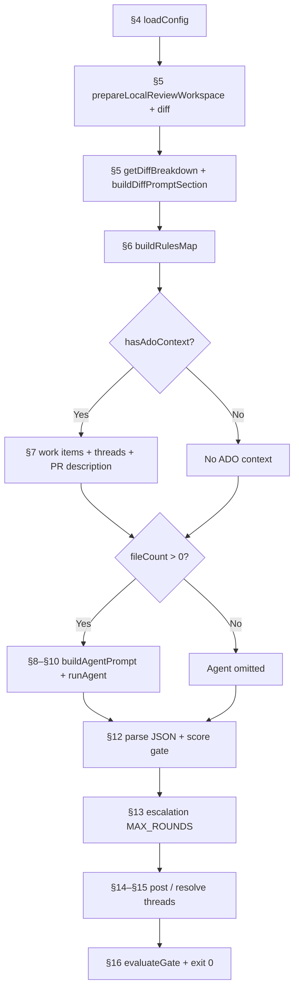

# FAQ — Agentic Code Reviewers

> **Variables:** canonical `AGENTIC_CODE_REVIEWERS_*` prefix for configuration; credentials `CURSOR_API_KEY` and `OPENCODE_API_KEY` (see [`../AGENTS.md`](../AGENTS.md)).
>
> See [`index.md`](index.md) for an overview and [`workflows.md`](workflows.md) for all execution paths.

---

## Quick index (execution order)

| # | Section | Runner moment |
|---|---------|----------------|
| 1 | [Overview](#1-overview) | — |
| 2 | [What it does and doesn't](#2-what-the-reviewer-does-and-doesnt) | — |
| 3 | [Timeline](#3-timeline-execution-order) | Full map |
| 4 | [Configuration](#4-configuration-and-prerequisites) | `loadConfig` |
| 5 | [Git, diff and files](#5-git-diff-and-file-selection) | `prepareLocalReviewWorkspace` |
| 6 | [Pre-mapped rules](#6-pre-mapped-rules) | `buildRulesMap` |
| 7 | [**User Story, Task and ADO context**](#7-user-story-task-and-ado-context) | `getPullRequestWorkItemContext` + PR + threads |
| 8 | [Prompt assembly](#8-prompt-assembly-system_prompt-vs-runtime) | `buildAgentPrompt` |
| 9 | [Execution engine](#9-execution-engine) | `runCodeReviewAgent` |
| 10 | [Two-phase analysis](#10-two-phase-analysis) | Inside the agent |
| 11 | [Score and severity](#11-score-severity-and-what-becomes-a-thread) | Agent classification |
| 12 | [JSON and parser](#12-json-response-and-parser) | `parseCodeReviewResponse` |
| 13 | [Round budget and escalation](#13-round-budget-and-escalation) | `round-state` (pre-publish) |
| 14 | [Posting to Azure DevOps](#14-posting-to-azure-devops) | `post-comments` |
| 15 | [Threads, dedup and resolution](#15-threads-dedup-and-resolution) | `review-context` |
| 16 | [Pipeline and exit codes](#16-pipeline-ci-and-exit-codes) | `gate` |
| 17 | [Troubleshooting](#17-troubleshooting) | — |
| 18 | [Auto-fix and self-healing](#18-auto-fix-and-self-healing) | `--auto-fix`, `auto-fix.yml` |
| 19 | [Evidence map](#19-evidence-map-in-the-code) | — |

---

## 1. Overview

### What is Agentic Code Reviewers?

**Answer:** A pluggable, extensible **multi-agent code reviewer** for Pull Requests on **Azure DevOps** and **GitHub**. It orchestrates agentic engines (`cursor-sdk`, `opencode`, extensible via `ExecutionEngine`) over the diff, applies project rules (`AGENTS.md`, `.cursor/rules/`, code-review skill) and **publishes threads** on the PR. **It does not modify code.** Fork it, add your engine or provider, review and open a PR.

*Evidence:* `README.md`; `src/index.ts`.

### Who decides whether a finding is valid?

**Answer:** Two layers — (1) **LLM agent:** triage, investigation, score, JSON; (2) **TypeScript:** gate score `AGENTIC_CODE_REVIEWERS_SCORE_MIN`–10 (default 6–10), required fields, dedup (`review-validation.ts`, `post-comments.ts`).

*Evidence:* [`flow-analysis.md`](flow-analysis.md); `parseCodeReviewResponse`.

### Does the review block the merge?

**Answer:** **Not by default.** Exit **0** even with pending threads. Exit **1** only on a fatal error (config, ADO, agent). A GitHub ruleset `required_review_thread_resolution` can block merge independently.

*Evidence:* `src/index.ts`; `README.md`.

---

## 2. What the reviewer does and doesn't

### What does the reviewer do?

**Answer:** (1) Preps git and diff; (2) filters eligible stack files; (3) collects work items and threads; (4) runs the agent in two phases (**read-only**); (5) parses JSON and applies the gate (`scoreMin` + Safe Outputs); (6) publishes/resolves threads; (7) emits a WITH/WITHOUT ISSUES summary. Optionally, CI triggers **auto-fix** in a separate workflow (`--auto-fix`).

*Evidence:* modules listed in `src/index.ts` (see [§3](#3-timeline-execution-order)).

### What doesn't the reviewer do?

**Answer:** The **default review flow** doesn't modify code, doesn't commit/push, and doesn't resolve a thread just because the line disappeared from the diff. It doesn't publish nits below `AGENTIC_CODE_REVIEWERS_SCORE_MIN` (default: score &lt; 6); it doesn't block the pipeline; it doesn't treat human/other-bot threads as bot pending.

**Exception — auto-fix mode:** with `--auto-fix` or the `auto-fix.yml` workflow, the runner **applies** fixes, commit/push and partially resolves threads — see [§18](#18-auto-fix-and-self-healing).

*Evidence:* `skills/SYSTEM_PROMPT.md` (read-only); `src/orchestrator/autofix-runner.ts`.

---

## 3. Timeline (execution order)

### What's the runner execution order?

**Answer:** See the diagram and table below — each row points to the FAQ section.



| Step | FAQ section | What happens | File |
|------|-------------|--------------|------|
| 1 | [§4](#4-configuration-and-prerequisites) | Loads env, CLI, ADO vars, validates model | `src/config.ts` |
| 2 | [§5](#5-git-diff-and-file-selection) | Checkout/fetch; diff `target...HEAD` | `src/git/diff.ts` |
| 3 | [§5](#5-git-diff-and-file-selection) | Filters `.cs`/`.ts`/`.html`; embeds diff (~100 KB) | `getDiffBreakdown`, `diff-prompt.ts` |
| 4 | [§6](#6-pre-mapped-rules) | Pre-maps `.cursor/rules/*.mdc` | `src/project/rules-map.ts` |
| 5 | [**§7**](#7-user-story-task-and-ado-context) | **Work items (US/Task), PR description, threads** | `work-items.ts`, `pull-request.ts`, `review-context.ts` |
| 6 | [§8](#8-prompt-assembly-system_prompt-vs-runtime) | Builds single prompt, calls agent | `src/agent/prompt.ts` |
| 7 | [§9–§10](#9-execution-engine) | Execution engine (cursor-sdk / opencode) runs the phases | `runner.ts`, `engine/` |
| 8 | [§12](#12-json-response-and-parser) | Extracts JSON; filters score ≥ AGENTIC_CODE_REVIEWERS_SCORE_MIN (default 6) | `parser/`, `post-comments.ts` |
| 9 | [§13](#13-round-budget-and-escalation) | Escalation (optional) | `round-state.ts` |
| 10 | [§14](#14-posting-to-azure-devops) | Resolves threads → posts new → summary | `post-comments.ts` |
| 11 | [§16](#16-pipeline-ci-and-exit-codes) | WITH/WITHOUT ISSUES summary | `gate.ts` |

*Evidence:* `src/index.ts` (~158–222) — empty diff + valid ADO omits steps 6–7; steps 8–11 still run.

### What happens if the diff is empty but there's ADO context?

**Answer:** The agent is **omitted**; the gate still lists the bot's pending threads.

*Evidence:* `src/index.ts`.

---

## 4. Configuration and prerequisites

### What can I edit in the runner?

**Answer:** `skills/SYSTEM_PROMPT.md` (JSON contract, read-only — **no** US/Task) and `skills/CODE_REVIEW.md` (harness routing). Business criteria live in the analyzed repo (`.agents/skills/code-review/`, `.cursor/rules/`, `docs/`). Local reference: `.env.example`.

*Evidence:* `src/config.ts`; `README.md`.

### How do I configure the LLM model?

**Answer:** Precedence: (1) CLI `--model <id>`; (2) env `AGENTIC_CODE_REVIEWERS_MODEL`; (3) engine default (`composer-2.5` in `cursor-sdk`, `anthropic/claude-sonnet-4-6` in `opencode`). Validation: `cursor-sdk` → enum in `src/engine/cursor-sdk/model.ts`; `opencode` → `provider/model` format in `src/engine/opencode/model.ts`. Unexpanded ADO macro → default.

*Evidence:* `src/config.ts` (`AGENTIC_CODE_REVIEWERS_ENGINE`, `resolveReviewerModel`); `src/engine/`.

### What's required to run?

**Answer:** With `cursor-sdk`: `CURSOR_API_KEY`. With `opencode`: `OPENCODE_API_KEY` (or `auth.json`). PAT/OAuth only needed for ADO (US/Task, threads, publication).

### Do I need a PAT locally?

**Answer:** Only for ADO context or real publication. Basic dry-run: just the API key. See [§7](#7-user-story-task-and-ado-context).

### What's the difference between dry-run and real publication?

**Answer:** `--dry-run`: analyzes and logs a preview; **no POST** to ADO. Real publication: org + project + repo + pr-id + token.

### Which env variables are most used?

**Answer:** `CURSOR_API_KEY` (cursor-sdk) or `OPENCODE_API_KEY` (opencode); `AGENTIC_CODE_REVIEWERS_MODEL`, `AGENTIC_CODE_REVIEWERS_AZURE_DEVOPS_PAT`, `AGENTIC_CODE_REVIEWERS_GITHUB_TOKEN` (fallback `GITHUB_TOKEN`/`GH_TOKEN`), `AGENTIC_CODE_REVIEWERS_TARGET_BRANCH`, `AGENTIC_CODE_REVIEWERS_MAX_ROUNDS` (default 10), `AGENTIC_CODE_REVIEWERS_TIMEOUT_MS`, `AGENTIC_CODE_REVIEWERS_REPO_ROOT`, `AGENTIC_CODE_REVIEWERS_STACK`. Full list: [`../README.md`](../README.md) and [`workflows.md`](workflows.md).

*Evidence:* `src/config.ts`; `test/config.test.ts`.

### Do the legacy names `CURSOR_REVIEWER_*` still work?

**Answer:** **No.** The runner reads only `AGENTIC_CODE_REVIEWERS_*` (via `src/env.ts`). Unexpanded ADO macros like `$(CURSOR_REVIEWER_MODEL)` still fall back to the default — update variable groups and `.env` to the canonical names. `AGENTIC_CODE_REVIEWERS_REPO_URL` and `AGENTIC_CODE_REVIEWERS_EXECUTION_MODE` exist only in `run.sh`/GitHub workflow; they don't go through `env.ts`.

*Evidence:* `src/env.ts`; `run.sh`; `.github/workflows/code-review.yml`.

### What's the difference between `skills/` and `.agents/skills/`?

**Answer:** Two layers:
- **`skills/`** — prompts embedded by the runner in **every** CI/local execution (`SYSTEM_PROMPT.md`, `CODE_REVIEW.md`, `stacks/`, `tasks/`). Assembled by `buildAgentPrompt()`.
- **`.agents/skills/`** — **Cursor/IDE** skills invoked manually (`/code-review-self`, `/megabrain`, `/solve-pr`).

Use the runner in production; use IDE skills for SDK-free dry-runs, conversational threads, or local GitHub fixes. Routing: [`../AGENTS.md`](../AGENTS.md) § Skills — Routing and Management; execution paths: [`workflows.md`](workflows.md).

### How does tech-stack selection work?

**Answer:** Lets you focus the review on specific file extensions and load architecture/security recommendations for the selected stack. Configured explicitly via CLI `--stack` or env `AGENTIC_CODE_REVIEWERS_STACK`. Unknown stack → fail-fast. If the env value contains an unexpanded ADO macro (like `$(AGENTIC_CODE_REVIEWERS_STACK)`) the runner auto-resolves to the default. If no stack/env is set, the runner tries to auto-detect.

*Evidence:* `src/config.ts`; `test/config.test.ts`.

### How does automatic stack auto-detection work?

**Answer:** The runner inspects the repo root (`repoRoot`) looking for specific files or packages declared in `package.json`:

1. **PHP/Laravel:** `artisan` file or `composer.json`.
2. **Next.js/React:** `next.config.js`/`next.config.mjs`/`next.config.ts`, or the `next` package in `package.json`.
3. **ABP/Angular:** `angular.json`, an `angular/` directory, or the `@angular/core` dependency.
4. **TypeScript:** `tsconfig.json` or the `typescript`/`tsx` package.
5. **C#/.NET (ABP/Angular):** `.sln` or `.csproj` files.

If none of the heuristics identify a stack, the runner assumes `ABP/Angular` as a fallback. The startup log explicitly states which stack is active and where it came from (`CLI`, `env`, `auto-detected`, or `default fallback`).

*Evidence:* `src/config.ts`; `src/index.ts`; `test/config.test.ts`.

### Which stacks are supported by default and what they filter?

**Answer:**

- **ABP/Angular** (default): filters `.cs`, `.ts`, `.html` (100% backward compatibility).
- **PHP/Laravel**: filters `.php`, `.js`, `.ts`, `.vue`, `.html`, `.css`, `.json`.
- **Next.js/React**: filters `.ts`, `.tsx`, `.js`, `.jsx`, `.html`, `.css`, `.json`.
- **TypeScript**: filters `.ts`, `.json`.

*Evidence:* `src/config.ts`.

### How does the stack behave in E2E tests (`--seed-test`)?

**Answer:** When `--seed-test` is set, the runner ignores any env-configured stack and forces `ABP/Angular`. This prevents C# and Angular validation fixtures from being filtered out and failing local tests.

*Evidence:* `src/config.ts`; `test/config.test.ts`.

### How are per-stack recommendation files embedded?

**Answer:** During prompt assembly, the runner reads the static recommendations from `skills/stacks/<stack-name>.md` (e.g. `typescript.md` or `php-laravel.md`) and appends its content to the `# Stack-specific recommendations (<name>)` section in the final agent prompt.

*Evidence:* `src/agent/prompt.ts`; `test/prompt.test.ts`.

---

## 5. Git, diff and file selection

### What diff is used?

**Answer:** Local: `{targetRef}...HEAD`. CI: `origin/{target}...origin/{source}` after fetch. With `--include-uncommitted`: adds working tree vs `HEAD`.

*Evidence:* `src/git/diff.ts`.

### Which files enter the review?

**Answer:** Include: per stack (default `**/*.cs`, `**/*.ts`, `**/*.html`). Exclude: proxies, bin/obj, `.md`, `.csproj`, the runner directory (legacy: `scripts/cursor-reviewer/**`) — anti self-review. Only **AMR** files in the diff.

*Evidence:* `src/config.ts`; `src/git/diff.ts`.

### How does the diff enter the prompt?

**Answer:** `buildDiffPromptSection` — up to **100 KB** embedded (`full` or `per-file`); above that the agent completes it via tools.

*Evidence:* `src/git/diff-prompt.ts` — `MAX_DIFF_PROMPT_BYTES = 100_000`.

### What's the difference between local and CI mode?

**Answer:** Local uses the current branch as source; CI uses remote refs after fetch in detached HEAD. ADO token in the next step: local PAT or `SYSTEM_ACCESSTOKEN` in the pipeline.

*Evidence:* `README.md` § git modes; [`workflows.md`](workflows.md).

---

## 6. Pre-mapped rules

### What are pre-mapped rules?

**Answer:** After the diff, `buildRulesMap` reads `.cursor/rules/*.mdc` and includes rules whose globs match changed files (+ `alwaysApply: true`).

### Where do they enter the prompt?

**Answer:** In the "execution context" section of the prompt ([§8](#8-prompt-assembly-system_prompt-vs-runtime)) — **not** in `SYSTEM_PROMPT.md`.

### Can the agent read more rules later?

**Answer:** **Yes**, in Phase 2 via tools (`settingSources: ['project']`).

*Evidence:* `src/project/rules-map.ts`; `src/index.ts` ~144–147.

---

## 7. User Story, Task and ADO context

### When are User Story and Task retrieved?

**Answer:** Only with `hasAdoContext` (org, project, repo, `pullRequestId`, token). In the **"Collecting Azure DevOps context"** step, **in parallel** with threads and PR description — **after** diff/rules and **before** prompt/agent. Order: config → git/diff → rules → **ADO (WI + PR + threads)** → prompt → agent.

*Evidence:* `src/index.ts` ~187–195 (`Promise.all` of `getPullRequestWorkItemContext`, `getPullRequestReviewContext`, `getPullRequestContext`).

### How does the API fetch User Story / Task?

**Answer:** (1) `GET .../pullRequests/{id}/workitems` → IDs linked to the PR; (2) `GET .../wit/workitems?ids=...&$expand=all` → details. Per item: type, title, state, description, acceptance criteria (if any). Default limit: **10** work items.

*Evidence:* `src/ado/work-items.ts` — `getPullRequestWorkItemContext`; log `formatWorkItemsLoadedLogMessage`.

### Are User Story and Task part of `SYSTEM_PROMPT.md`?

**Answer:** **No.** `skills/SYSTEM_PROMPT.md` is **static** (JSON contract, score/severity). US/Task come from the **ADO API at runtime** and enter the composed prompt ([§8](#8-prompt-assembly-system_prompt-vs-runtime)).

| Layer | Varies per PR? |
|-------|----------------|
| `SYSTEM_PROMPT.md` + `CODE_REVIEW.md` | No |
| PR description, work items, threads, diff, rules | **Yes** |

### Where do US/Task enter the composed prompt?

**Answer:** `buildAgentPrompt` concatenates a **single string** (no separate system message). Relevant order: (6) PR description; (8) two-phase workflow; **(9) `workItemContext`** — `## Linked Work Items` section; (10) bot threads. Work items sit **near the end**, after the phase instructions, before threads.

*Evidence:* `src/agent/prompt.ts` ~246–252; format in `work-items.ts`.

### Is PR ID the same as a Work Item ID?

**Answer:** **No.** The PR section explicitly warns: PR ID (#610) ≠ US/Task IDs (#2418) in `Linked Work Items`.

*Evidence:* `buildPullRequestContextForLlm` in `src/ado/pull-request.ts`.

### How does the agent use US/Task in code review?

**Answer:** Phase 1 incorporates PR description, work items and threads as **scope context**. Phase 2 confronts the diff with the acceptance criteria. Evident AC missing → `critical` tendency; partial → `warning`. The WI is **context**, not an infinite checklist — the agent doesn't invent requirements. Local plans (`.cursor/plans/`) are **not** fetched automatically; only if read via tools in Phase 2.

*Evidence:* `buildTwoPhaseWorkflow` in `src/agent/prompt.ts`; `scripts/code-review/prompts/exemplo.codereviewprompt.md`.

### What if there are no linked work items?

**Answer:** No WIs on the PR → `contextForLlm = ''` (section omitted). No ADO context (dry-run without `--pr-id`) → no API call. API failure → warning in the log; review **continues** without WIs.

*Evidence:* `getPullRequestWorkItemContext` — empty return or catch.

### Which ADO permissions are needed for work items?

**Answer:** Build Service needs **View work items in this node** (Read) and **Contribute to pull requests** to publish threads.

*Evidence:* `README.md` § Azure DevOps prerequisites.

---

## 8. Prompt assembly (system_prompt vs runtime)

### How is the final prompt assembled?

**Answer:** `buildAgentPrompt` concatenates sections in this order: (1) `SYSTEM_PROMPT.md`; (2) `CODE_REVIEW.md`; (3) execution context; (4) pre-mapped rules; (5) diff; (6) PR description; (7) seed test (if `--seed-test`); (8) two-phase workflow + verdict; (9) work items; (10) existing threads. Positions **1–2** are static; **3–10** are runtime (git, ADO, threads).

*Evidence:* `src/agent/prompt.ts` — `buildAgentPrompt`.

### Does the project harness (`AGENTS.md`, code-review skill, `docs/`) get pasted into the prompt?

**Answer:** **No.** The agent **reads via tools** in Phase 2. Only these are pasted: `SYSTEM_PROMPT.md`, `CODE_REVIEW.md`, diff, pre-mapped rules and ADO context.

*Evidence:* `src/agent/prompt.ts`; `skills/CODE_REVIEW.md`.

---

## 9. Execution engine

### How is the agent executed technically?

**Answer:** `runCodeReviewAgent` builds the prompt → `Agent.create` (apiKey, model, `local` options) → `agent.send(prompt)` → event stream → `run.wait()` → final text in `result.result`.

*Evidence:* `src/agent/runner.ts`; `src/engine/` (`getEngine`, `ExecutionEngine.run`).

### Which local options does the agent use?

**Answer:** `cwd` = `repoRoot`; `settingSources: ['project']` (harness via tools); read-only sandbox default (`AGENTIC_CODE_REVIEWERS_SANDBOX=false` disables); `enableAgentRetries: true`.

*Evidence:* `buildLocalOptions` in `src/engine/cursor-sdk/stream.ts`.

### Can the agent modify files?

**Answer:** **No** — three layers: (1) prompt forbids editing; (2) SDK sandbox; (3) the runner doesn't implement auto-fix in this path. If the sandbox is unsupported, it retries **without sandbox** keeping the read-only contract from the prompt.

*Evidence:* `skills/SYSTEM_PROMPT.md`; `src/engine/cursor-sdk/stream.ts` — `isSandboxUnsupportedError`.

### What's the default timeout?

**Answer:** **10 minutes** (`AGENTIC_CODE_REVIEWERS_TIMEOUT_MS`). On expiry, calls `run.cancel()`.

*Evidence:* `DEFAULT_TIMEOUT_MS` in `src/engine/cursor-sdk/stream.ts` and `src/engine/opencode/stream.ts`.

### Which LLM model is used?

**Answer:** Default **`composer-2.5`**. Precedence: `--model` > `AGENTIC_CODE_REVIEWERS_MODEL` > default. Details: [§4](#4-configuration-and-prerequisites).

*Evidence:* `src/engine/cursor-sdk/model.ts`, `src/engine/opencode/model.ts`; `src/config.ts`.

---

## 10. Two-phase analysis

### How many analysis phases are there?

**Answer:** **Two** in the **same** agent call (not two separate agents). Details: [`two-phase-execution-model.md`](two-phase-execution-model.md).

### What is Phase 1 — Triage?

**Answer:** A **hypothesis** map `(file, line, hypothesis)` — no final verdict. Uses the embedded diff or `git diff`; incorporates PR, work items and threads ([§7](#7-user-story-task-and-ado-context)). Discards nits, style and theory without runtime. On `*.html`: ignores layout/CSS; focuses on security, permissions, bindings.

*Evidence:* `buildTwoPhaseWorkflow` in `src/agent/prompt.ts` § Phase 1.

### What is Phase 2 — Investigation?

**Answer:** Per candidate, **prove with tools** before publishing: (2.1) read rules + code-review skill; (2.2) expand context (entity, AppService, EF, Angular, tests); (2.3) **4 mandatory proofs** in `analysis` + `impactPaths`; (2.4) assign severity/score; filter score &lt; `AGENTIC_CODE_REVIEWERS_SCORE_MIN` (default 6); (2.5) generalize by class (`grep`/`glob` for sibling occurrences). Without the 4 proofs → **not in** `reviews`.

*Evidence:* `src/agent/prompt.ts` § Phase 2; `.agents/skills/code-review/SKILL.md`.

### Why "completeness in the same round"?

**Answer:** To avoid the infinite fix→review loop. The mandate is to list **all** material findings at once or `"reviews": []`.

*Evidence:* `skills/SYSTEM_PROMPT.md` § "Mission"; step 2.5 in `prompt.ts`.

---

## 11. Score, severity and what becomes a thread

### Is there a score formula?

**Answer:** **No.** The agent **assigns** score (0–10) and severity qualitatively. TypeScript only accepts **AGENTIC_CODE_REVIEWERS_SCORE_MIN–10** for publication (default **6–10**). Full doc: [`score_calc.md`](score_calc.md).

*Evidence:* `src/ado/review-validation.ts` — `DEFAULT_SCORE_MIN = 6`; `src/config.ts` — `AGENTIC_CODE_REVIEWERS_SCORE_MIN` / `--score-min`; `skills/SYSTEM_PROMPT.md`.

### Which scores are published?

**Answer:** With the default (`AGENTIC_CODE_REVIEWERS_SCORE_MIN=6`): 0–5 → not published; 6–8 → `warning` or `suggestion`; 9–10 → `critical`. With a lower `AGENTIC_CODE_REVIEWERS_SCORE_MIN` (e.g. `4`), scores 4–5 may also become threads if they pass the full gate.

*Evidence:* `src/ado/review-validation.ts`; [`score_calc.md`](score_calc.md).

### How do I configure the publication threshold (`AGENTIC_CODE_REVIEWERS_SCORE_MIN`)?

**Answer:** Optional. Env `AGENTIC_CODE_REVIEWERS_SCORE_MIN=N` or CLI `--score-min N` (precedence: CLI > env > default `6`). **Omitting** both keeps existing pipelines intact — no breaking change. The value is injected into the prompt (`buildExecutionContext`, Phase 2.4), applied in `isPublishableReview` and in Safe Outputs (`severity-score`).

*Evidence:* `src/config.ts`; `src/agent/prompt.ts`; `src/ado/safe-outputs.ts`; `README.md`.

### Is `score_min` the same for cursor-sdk and opencode?

**Answer:** **Yes.** Both engines use the same `config.scoreMin` via `buildAgentPrompt` and `parseCodeReviewResponse`. There is no per-engine threshold.

*Evidence:* `src/agent/runner.ts`; `src/index.ts`.

### Why didn't a score-5 review become a thread with `SCORE_MIN=4`?

**Answer:** Check: (1) consistent `severity`/`score` in Safe Outputs; (2) `analysis` with 4 numbered sections; (3) line in the diff (`REQUIRE_DIFF_LINE`); (4) protected path; (5) agent omitted it in JSON (prompt filter). Logs: `Policy: N review(s) discarded` and `Safe Outputs: N review(s) discarded`.

*Evidence:* `post-comments.ts`; `safe-outputs.ts`.

---

## 12. JSON response and parser

### What's the expected JSON format?

**Answer:** Object with `reviews[]` (fileName, lineNumber, severity, comment, score, developerAction, analysis, impactPaths, suggestedFix?), `resolvedThreads[]` and `reviewSummary`.

*Evidence:* `skills/SYSTEM_PROMPT.md`; `src/ado/types.ts`.

### How is the JSON extracted from the agent output?

**Answer:** `extractJsonFromAgentOutput`: (1) preference — last valid ```` ```json ```` fence; (2) fallback — last balanced `{...}` object with `"reviews"`; (3) sanitization if `JSON.parse` fails. Then `parseCodeReviewResponse` applies `filterPublishableReviews`.

*Evidence:* `src/parser/review-response.ts` — `extractJsonFromAgentOutput`.

---

## 13. Round budget and escalation

### Why is there round escalation?

**Answer:** To avoid the infinite **fix ↔ reviewer** loop (manual, `solve-pr`, CI auto-fix) when residual issues persist after several rounds.

### How does escalation work?

**Answer:** Counter in a general thread (`<!-- reviewer-round-state -->`). `currentRound = previous rounds + 1`. If `currentRound > maxRounds` **and** there are open issues: publishes **only** `critical`; suppresses new `warning`/`suggestion`; warns **human review recommended**. Default `maxRounds`: **10** (`AGENTIC_CODE_REVIEWERS_MAX_ROUNDS`; `0` disables).

*Evidence:* `src/ado/round-state.ts`; `src/index.ts` ~261–283; `src/config.ts` — `DEFAULT_MAX_ROUNDS = 10`.

---

## 14. Posting to Azure DevOps

### When does a review become a thread?

**Answer:** When it passes `isPublishableReview` (score ≥ `AGENTIC_CODE_REVIEWERS_SCORE_MIN`, default 6, fields OK) **and** it isn't a duplicate on the same line.

*Evidence:* `src/ado/post-comments.ts` — `setPullRequestComments`, `isDuplicateReview`.

### What's the format of the posted thread?

**Answer:** `Agentic Code Reviewer {engine}` + emoji/severity + comment + suggested fix (optional) + `<details>` with score, analysis and paths. The tag is derived from `AGENTIC_CODE_REVIEWERS_ENGINE` (e.g. `Agentic Code Reviewer cursor-sdk`). **Does not** use ```` ```suggestion ```` — ADO doesn't apply inline suggestions like GitHub.

*Evidence:* `formatCommentForPosting` in `src/ado/format-thread.ts`.

### How does the `reviews` vs `reviewSummary` policy work?

**Answer:** `score_min` defines which findings become **threads** on the PR (auto-fix reads only threads). The summary comment is posted **at the end** of the review, after resolving/posting threads, when **no remaining** active/pending bot threads — fixed message (`CLEAN_PR_SUMMARY_MESSAGE`); LLM text ignored.

*Evidence:* `shouldPostReviewSummary` and `getCodeReviewPostingPlan` in `src/ado/post-comments.ts`; `src/index.ts` (refresh before summary).

### What shows up on the Azure DevOps build?

**Answer:** With `TF_BUILD=true`, emits `##vso[task.logissue]` per finding and `##vso[task.uploadsummary]` with markdown — **without changing the exit code**.

*Evidence:* `src/ado/pipeline-logging.ts`; `src/index.ts` ~424.

---

## 15. Threads, dedup and resolution

### How does publication dedup work?

**Answer:** Key `normalizedPath\|line:N` — not re-posted on the same line if there's already an **active/pending** bot thread.

*Evidence:* `src/ado/review-context.ts` (`existingKeys`); `isDuplicateReview` in `post-comments.ts`.

### Which threads enter the prompt?

**Answer:** Bot active/pending → yes (prompt + dedup). Bot resolved → yes (anti-re-litigation memory), without dedup. Humans/other bots → no.

*Evidence:* [`flow-analysis.md`](flow-analysis.md) § ADO threads.

### How are old threads resolved?

**Answer:** The agent returns `resolvedThreads` with `threadId` or `fileName`+`lineNumber` **only if it verified** the fix via tools — not because the line disappeared from the diff. The runner posts a reply with `<!-- resolution-reply -->` and status `fixed`.

*Evidence:* `resolvePullRequestReviewThreads` in `src/ado/post-comments.ts`; `src/git/markers.ts`.

---

## 16. Pipeline CI and exit codes

### What are the exit codes?

**Answer:** **0** — execution completed (with or without review issues). **1** — fatal error (config, PAT/API key, ADO, agent). The internal gate (`evaluateGate`) reports "WITH PENDING ISSUES" but **does not** change exit to 1.

*Evidence:* `src/ado/gate.ts`; `src/index.ts`; `README.md` § exit codes.

### What does dry-run do regarding the exit code?

**Answer:** Simulates JSON, thread preview and resolutions; **no POST** to ADO. Exit **0** unless execution error.

*Evidence:* `src/index.ts` `if (config.dryRun)` block.

---

## 17. Troubleshooting

### No eligible files in the diff — what to do?

**Answer:** The diff contains no reviewable `.cs`/`.ts`/`.html` (per stack), or all were excluded (proxies, bin/obj, etc.).

*Evidence:* `README.md` § Troubleshooting.

### Agent omitted but the pipeline continues — why?

**Answer:** Empty diff with valid ADO context → skips the agent; the gate still lists the bot's pending threads.

*Evidence:* `src/index.ts` ~153–160, ~225–227.

### Invalid JSON in the response — how to diagnose?

**Answer:** The parser tries fences + balanced objects + sanitization. Run `--verbose` and inspect the raw output.

*Evidence:* `src/parser/review-response.ts`.

### Threads don't show up on the PR — what to check?

**Answer:** Score ≥ `AGENTIC_CODE_REVIEWERS_SCORE_MIN` (default 6, not fixed 6 if configured)? Required fields? Safe Outputs (diff-line, analysis)? Dedup on same line? Dry-run active? Build Service with "Contribute to pull requests"? OAuth token enabled in the pipeline?

*Evidence:* `review-validation.ts`, `safe-outputs.ts`, `post-comments.ts`, `README.md` § Azure DevOps prerequisites.

### The reviewer points at its own code (the runner directory) — why?

**Answer:** Exclude active by default (anti self-review). `AGENTIC_CODE_REVIEWERS_REVIEW_SELF=true` only for developing the runner.

*Evidence:* `src/config.ts` — exclude patterns.

### Work items (US/Task) don't appear in the review — what to check?

**Answer:** Are WIs **linked** to the PR in ADO? Full ADO context + token? Dry-run **with** `--pr-id` and PAT? If the API fails, the runner logs a warning and continues **without** the `Linked Work Items` section. See [§7](#7-user-story-task-and-ado-context).

*Evidence:* `getPullRequestWorkItemContext` in `src/ado/work-items.ts`.

### Why did the bot re-raise an already-fixed issue?

**Answer:** It should only re-open with **new evidence**. Resolved threads enter the prompt as memory; the agent shouldn't duplicate without proof.

*Evidence:* `buildVerdictAndAdoPolicy` in `prompt.ts`; `flow-analysis.md`.

### `Resource not accessible by integration` when resolving threads on GitHub

The default `GITHUB_TOKEN` of Actions **publishes** comments with `pull-requests: write`, but the GraphQL `resolveReviewThread` mutation is typically **rejected** for integration tokens — even on threads created by the bot itself.

The runner treats this as a warning (does not fail the pipeline): the resolution reply may be posted, but the thread remains open in the UI.

**To enable automatic resolution**, configure a PAT (classic `repo` or fine-grained `pull_requests: write`) as the secret `AGENTIC_CODE_REVIEWERS_GITHUB_TOKEN` in the repository. The `code-review.yml` and `review-remote.yml` workflows use that secret when present; otherwise they fall back to `github.token`.

```yaml
# .github/workflows/code-review.yml (already supported)
AGENTIC_CODE_REVIEWERS_GITHUB_TOKEN: ${{ secrets.AGENTIC_CODE_REVIEWERS_GITHUB_TOKEN || github.token }}
```

### OpenCode stops after `Session created` with no progress

1. Confirm `opencode` is in `PATH` and credentials (`auth.json` or `OPENCODE_API_KEY`) exist.
2. Enable logs: `AGENTIC_CODE_REVIEWERS_OPENCODE_LOG_LEVEL=DEBUG` (default).
3. Verify the preferred port is free, or use `AGENTIC_CODE_REVIEWERS_OPENCODE_PORT=0` or let the runner pick a free port automatically.
4. In non-interactive CI, do **not** use `ask` permissions — the runner denies automatically in the embedded config.

### `HeadersTimeoutError` / `fetch failed` with OpenCode

`session.prompt` only returns HTTP when the agent finishes (tool calls + LLM). The OpenCode client uses `undici.fetch` with `headersTimeout`/`bodyTimeout` equal to `AGENTIC_CODE_REVIEWERS_TIMEOUT_MS` (default 10 min), cancellation via `AbortSignal` and recursive detection of `UND_ERR_HEADERS_TIMEOUT`/`UND_ERR_BODY_TIMEOUT`. If the review takes longer, bump it:

```bash
AGENTIC_CODE_REVIEWERS_TIMEOUT_MS=1200000 npm run review -- --dry-run --engine opencode ...
```

---

## 18. Auto-fix and self-healing

### Does the reviewer fix code automatically?

**Answer:** The **standard review** (`npm run review`) is **read-only**. Automatic fixing exists in the **`--auto-fix`** mode (`AGENTIC_CODE_REVIEWERS_AUTO_FIX=true`) or in the [`auto-fix.yml`](../.github/workflows/auto-fix.yml) pipeline: per-file sub-agents apply replacements, local commit, **validation build**, thread resolution and push.

*Evidence:* `src/index.ts` (`config.autoFix`); `src/orchestrator/autofix-runner.ts`; [`auto-fix.md`](auto-fix.md).

### What's the difference between auto-fix (CI) and the `solve-pr` skill?

**Answer:** **Auto-fix CI** — triggered by `workflow_run` after code review; uses `run.sh --auto-fix` with configured engines; fixes only bot threads. **`solve-pr`** — IDE skill (`.agents/skills/solve-pr/`) for the local operator: fetches **all** open threads on the PR, fixes them, manually commits/pushes. Both require a token with PR write access.

*Evidence:* `AGENTS.md` § Skills routing; [`workflows.md`](workflows.md) § Auto-fix and § solve-pr.

### Why did the review → fix → review loop stop after the first fix?

**Answer:** (1) Default `GITHUB_TOKEN` doesn't re-trigger workflows — use a PAT (`AGENTIC_CODE_REVIEWERS_GITHUB_TOKEN`); (2) auto-fix produced no commit (clean working tree); (3) `MAX_ROUNDS` escalated to human handoff; (4) post-commit build or push failed — the auto-fix job ends with exit ≠ 0 (check engine logs and the "Fail if all configured auto-fix engines failed" step).

*Evidence:* [`auto-fix.md`](auto-fix.md); `.github/workflows/auto-fix.yml`.

### Does auto-fix resolve all threads of a file at once?

**Answer:** **Not necessarily.** Only threads whose **line content** changed after the replacements are marked as resolved. Threads inside a wide range but with no change on their line remain open.

*Evidence:* `isThreadLineModified` in `autofix-runner.ts`; `test/autofix.test.ts`.

### Can I run auto-fix locally?

**Answer:** Yes, with PR context and a token:

```bash
npm run review -- --gh --pr-id 42 --source-branch feat/x --target-branch main --auto-fix
```

Use `--dry-run` on the review runner to validate threads without publishing; auto-fix respects `dryRun` (simulates commit/resolution).

*Evidence:* `src/config.ts` — `--auto-fix`; `autofix-runner.ts`.

### What should an agent/developer update when changing the runner?

**Answer:** Every behavior change requires **tests** (`npm test`) **and** documentation in sync in the same PR: `AGENTS.md`, `README.md`, affected `docs/` (`faq.md`, `index.md`, `flow-analysis.md`, `score_calc.md`, `auto-fix.md`, `workflows.md`, `two-phase-execution-model.md`), `skills/` if prompts/gates change, `.env.example` if env vars change, workflows/examples if CI changes. See [`../AGENTS.md`](../AGENTS.md) § Definition of Done.

*Evidence:* `AGENTS.md` — Invariant Behavior (Developer Agent).

---

## 19. Evidence map in the code

### Where to find each documented topic in the code?

| Topic | Main file |
|-------|-----------|
| Orchestration | `src/index.ts` |
| Config / CLI / env | `src/config.ts` |
| LLM model | `src/engine/cursor-sdk/model.ts`, `src/engine/opencode/model.ts` |
| Git diff | `src/git/diff.ts`, `src/git/diff-prompt.ts` |
| Prompt assembly | `src/agent/prompt.ts` |
| Agent execution | `src/agent/runner.ts`, `src/engine/` (`getEngine`) |
| Pre-mapped rules | `src/project/rules-map.ts` |
| JSON parser | `src/parser/review-response.ts` |
| Score gate | `src/ado/review-validation.ts` |
| Safe Outputs | `src/ado/safe-outputs.ts` |
| Auto-fix | `src/orchestrator/autofix-runner.ts`, `src/git/autofix-commit.ts` |
| ADO post | `src/ado/post-comments.ts` |
| Thread format | `src/ado/format-thread.ts` |
| Threads context | `src/ado/review-context.ts` |
| PR description | `src/ado/pull-request.ts` |
| Work items / US / Task | `src/ado/work-items.ts` |
| Escalation | `src/ado/round-state.ts` |
| Summary / exit | `src/ado/gate.ts` |
| Pipeline logging | `src/ado/pipeline-logging.ts` |
| LLM contract | `skills/SYSTEM_PROMPT.md` |
| Harness | `skills/CODE_REVIEW.md` |
| Project criteria | `.agents/skills/code-review/SKILL.md` |

---

## Alphabetical index (one-line answers)

| Question | Short answer |
|----------|--------------|
| Does the bot fix code? | **Standard review: no.** `--auto-fix` / `auto-fix.yml` mode: **yes** (commit + push). |
| Does it block merge? | **No** — exit 0 with issues (a GitHub ruleset can require resolved threads). |
| Auto-fix vs solve-pr? | CI: `auto-fix.yml` + `--auto-fix`. Local IDE: `/solve-pr` skill. |
| Per-engine `score_min`? | **No** — same `config.scoreMin` for cursor-sdk and opencode. |
| How is the prompt assembled? | System Prompt + CODE_REVIEW + context + diff + rules + ADO + 2-phase workflow (`prompt.ts`). |
| Does the agent read the repo? | **Yes** — tools with `settingSources: ['project']` and read-only sandbox. |
| How many analysis phases? | **Two** in the same execution: triage → investigation. |
| How is the score calculated? | **Qualitative assignment** by the LLM; gate `AGENTIC_CODE_REVIEWERS_SCORE_MIN`–10 in TypeScript (default 6) ([`score_calc.md`](score_calc.md)). |
| What becomes a thread? | Review with score ≥ `AGENTIC_CODE_REVIEWERS_SCORE_MIN` (default 6), fields OK, non-duplicated line. |
| How to lower the threshold? | `AGENTIC_CODE_REVIEWERS_SCORE_MIN=4` or `--score-min 4` (opt-in; omit = default 6). |
| Why did a warning vanish in round 4? | Escalation `MAX_ROUNDS` — only `critical` keeps being published. |
| Can I test locally? | `npm run review -- --dry-run` at the repo root (or in the submodule if installed in `scripts/agentic-code-reviewers/`). |
| How to contribute to the runner? | Fork → implement → `npm test` → update docs (`AGENTS.md` § Definition of Done) → PR. |
| Where to customize criteria? | Target repo: `.agents/skills/code-review/`; runner: `skills/SYSTEM_PROMPT.md`. |
| IDE skills vs runtime? | Runtime: `skills/` (CI); IDE: `.agents/skills/` — see [`../AGENTS.md`](../AGENTS.md) § Skills and [`workflows.md`](workflows.md). |
| Work items in the review? | If linked to the PR + ADO token — step [§7](#7-user-story-task-and-ado-context); **not** in `SYSTEM_PROMPT.md`. |
| Is US/Task part of the system prompt? | **No** — dynamic ADO API content appended to the composed prompt ([§8](#8-prompt-assembly-system_prompt-vs-runtime)). |
| How to configure the model? | `--model` > `AGENTIC_CODE_REVIEWERS_MODEL` > default `composer-2.5`; IDs in `model.ts`. |
| Invalid model in the pipeline? | Empty ADO macro falls back to default; nonexistent enum ID → exit 1 on startup. |
| Do I need a local PAT? | Only for ADO (threads/work items/publication); basic dry-run: engine credential (`CURSOR_API_KEY` or `OPENCODE_API_KEY`). |

---

## References

| Document | Content |
|-----------|---------|
| [`auto-fix.md`](auto-fix.md) | Self-healing cycle, PAT, protections |
| [`flow-analysis.md`](flow-analysis.md) | Full technical flow |
| [`score_calc.md`](score_calc.md) | Score and severity |
| [`two-phase-execution-model.md`](two-phase-execution-model.md) | Two-phase model |
| [`workflows.md`](workflows.md) | All execution paths (local, CI, IDE, engines) |
| [`../README.md`](../README.md) | Installation, ADO pipeline, CLI |
| [`../SEED-ISSUES.md`](../SEED-ISSUES.md) | Local test with intentional defects |