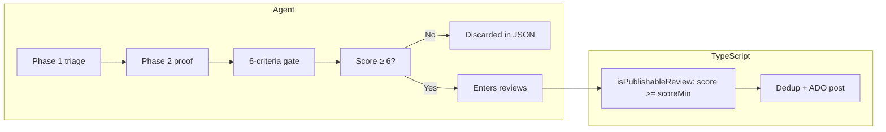

# Analysis and decision flow — Agentic Code Reviewers

> **Reference artifact** — full flow from diff preparation to the decision of what becomes a real thread on the PR.
>
> See [`index.md`](index.md) for an overview. See [`workflows.md`](workflows.md) for the surrounding execution paths.
> **Variables:** canonical `AGENTIC_CODE_REVIEWERS_*` prefix — see [`../AGENTS.md`](../AGENTS.md).
> **Last revision:** Jun/2026 (SDK read-only sandbox, real timeout cancellation, canonical result via `run.wait()`, ADO logging commands, removed `urgency` field, language-fenced fixes instead of ```suggestion).

---

## Overview

The runner is **review-only by default**: it analyzes the PR diff, publishes actionable threads (Azure DevOps, GitHub), and **does not modify code** in the `npm run review` flow. Fixes are the developer's responsibility, or the opt-in `--auto-fix` flow / [`auto-fix.yml`](../.github/workflows/auto-fix.yml) — see [`auto-fix.md`](auto-fix.md).

```mermaid
flowchart TD
    A[PR updated / npm run review] --> B[index.ts: git + file filter]
    B --> C{Eligible files?}
    C -->|No + no ADO| D[End]
    C -->|No + ADO| E[Skip agent; evaluate gate]
    C -->|Yes| F[Collect ADO: work items + threads]
    F --> G[LLM engine: cursor-sdk / opencode (Phases 1–2)]
    G --> H[JSON parser]
    H --> I[Filter score &lt; AGENTIC_CODE_REVIEWERS_SCORE_MIN (default 6) + summary policy]
    I --> J[Dedup file+line]
    J --> K[Publish / resolve threads]
    K --> L[evaluateGate — summary]
    L --> M{Bot's open threads?}
    M -->|Yes| N[exit 0 + log WITH ISSUES]
    M -->|No| O[exit 0 + log NO ISSUES]
    B -->|Error| P[exit 1]
    G -->|Engine error| P
```

---

## Execution timeline

Exact order in `src/index.ts`:

| # | Step | Module | When |
|---|------|--------|------|
| 1 | Load config (env + CLI + implicit ADO vars) | `config.ts` | Start |
| 2 | Prepare git workspace (local or CI) | `git/diff.ts` | Before diff |
| 3 | List and filter eligible files | `git/diff.ts` | Before agent |
| 4 | Collect work items + ADO threads | `ado/work-items.ts`, `ado/review-context.ts` | Parallel, if token + PR |
| 5 | Resolve engine, build prompt, run agent | `engine/`, `agent/prompt.ts`, `agent/runner.ts` | If `fileCount > 0` |
| 6 | Parse JSON response | `parser/review-response.ts` | After agent |
| 7 | Apply publication plan (score, summary) | `ado/post-comments.ts` | Before posting |
| 8 | Resolve confirmed threads → post new → summary | `ado/post-comments.ts` | Pipeline (not dry-run) |
| 9 | Summarize open issues (exit 0) | `ado/gate.ts` | End |

---

## Layer 1 — Context injected into the prompt (runner)

### Git

- **Range:** `target...HEAD` (local) or `origin/target...origin/source` (CI).
- **In the prompt:** source/target branch, `diffRange`, count and list of eligible paths (up to 30).
- **Embedded diff:** `buildDiffPromptSection` injects a unified diff (small PRs) or per-file content up to ~100 KB; the agent uses it in Phase 1 without depending solely on `git diff` via tools.
- **Pre-mapped rules:** `buildRulesMap` resolves `.cursor/rules/*.mdc` by glob of changed files + `alwaysApply`.
- **Patch summary log:** per eligible file (name + size in KB via `getDiffFileSummaries`).
- **Path filter:** `getDiffFileSummaries` / `getDiffPatch` limit scope to post-include/exclude files (`buildPathArgs` + `filterFilesByScope`).
- **Diff filter:** `--diff-filter=AMR` (Added, Modified, Renamed) in all git diff commands.

### Eligible files and stack selection (`config.ts`)

Eligible files for diff/review are determined by the tech stack selected via CLI (`--stack`) or env (`AGENTIC_CODE_REVIEWERS_STACK`). Defaults to `ABP/Angular`.

| Stack | Default include patterns |
|-------|--------------------------|
| ABP/Angular | `**/*.cs`, `**/*.ts`, `**/*.html`, `*.cs`, `*.ts`, `*.html` |
| PHP/Laravel | `**/*.php`, `**/*.js`, `**/*.ts`, `**/*.vue`, `**/*.html`, `**/*.css`, `**/*.json`, and `*.php` etc. |
| Next.js/React | `**/*.ts`, `**/*.tsx`, `**/*.js`, `**/*.jsx`, `**/*.html`, `**/*.css`, `**/*.json`, and `*.ts` etc. |
| TypeScript | `**/*.ts`, `**/*.json`, `*.ts`, `*.json` |

The default exclude filter removes proxies, bin/obj, `.md`, `.csproj` and by default the runner's own directory (legacy: `scripts/cursor-reviewer/**`) to avoid unwanted self-review.

Related variables: `AGENTIC_CODE_REVIEWERS_STACK`, `AGENTIC_CODE_REVIEWERS_REVIEW_SELF`, `AGENTIC_CODE_REVIEWERS_EXTRA_EXCLUDE_PATTERNS`. See [`../README.md`](../README.md) § Stacks.

### Work items (Azure DevOps)

**When:** after the diff, before the agent, if `org + project + repo + pr-id + token` are present.

**API:**

1. `GET /pullRequests/{id}/workitems` — IDs linked to the PR.
2. `GET /wit/workitems?ids=...&$expand=all` — details (max **10** items).

**Fields included in the prompt:**

- `System.WorkItemType` (User Story, Task, Bug, ...)
- `System.Title`, `System.State`
- `System.Description` (HTML → text)
- `Microsoft.VSTS.Common.AcceptanceCriteria` (if present)

**Not automatically included:** US → child tasks hierarchy (only what is linked to the PR); PR description/title, commits, local plans (`.cursor/plans/`); custom fields, tags, sprint, relations.

### Existing bot threads

**API:** `GET /pullRequests/{id}/threads`

| Use | Scope |
|-----|-------|
| **Dedup** (`existingKeys`) | Bot threads **active/pending** with `filePath` — key `path\|line:N` |
| **Prompt LLM (intra-PR memory)** | Summaries of **all** threads (active and resolved) consolidated into `Risk Patterns Detected in This PR` to actively steer Phase 1/2 searches |
| **Prompt LLM (active)** | Detailed "Active threads (open)" table (~160 chars each) |
| **Prompt LLM (closed memory)** | "Already resolved threads" table with instruction to **not re-raise without new evidence** (anti-re-litigation loop) |
| **Gate** | Bot threads **active/pending** (`Agentic Code Reviewer`) |

Human threads do **not** enter the prompt and do **not** count as the bot's pending threads. Resolved threads do **not** enter `existingKeys` (deterministic dedup) — they become memory for the LLM only.

### Fixed instructions and stack prompts

- `skills/SYSTEM_PROMPT.md`: read-only mode, JSON contract, severity/score classification and publication filter.
- `skills/CODE_REVIEW.md`: routing to the project harness (skills/rules via tools).
- `skills/stacks/*.md`: per-stack recommendations injected dynamically.
- `src/agent/prompt.ts`: execution context (including the active stack name) + **two-phase analysis** (triage → deep investigation → JSON verdict).

---

## Layer 2 — Project harness (agent, on demand)

With `settingSources: ['project']` in `engine/cursor-sdk/stream.ts` (engine `cursor-sdk`):

- `AGENTS.md`, `.cursor/rules/`, `docs/`
- `.agents/skills/code-review/SKILL.md` (required to read in Phase 0)

The agent does **not** receive the contents of these files in the initial prompt — it reads them via tools during execution.

### SDK guardrails (`engine/cursor-sdk/stream.ts`)

- **Read-only sandbox:** `local.sandboxOptions.enabled` (default `true`; `AGENTIC_CODE_REVIEWERS_SANDBOX=false` only for debugging) restricts writes to `cwd` and denies network — a technical enforcement of the read-only contract on top of `SYSTEM_PROMPT.md`. In environments that don't support the SDK local sandbox (e.g. hosted CI agents) `runAgentStream` detects the error and retries automatically without sandbox (read-only still guaranteed by `SYSTEM_PROMPT.md`).
- **Canonical result:** final text comes from `run.wait()` → `RunResult.result`; the accumulated stream (`fullText`) is only a fallback.
- **Timeout with real cancellation:** the SDK does not accept `AbortSignal`; when `AGENTIC_CODE_REVIEWERS_TIMEOUT_MS` expires the runner calls `run.cancel()` (aborts stream + tool calls and resolves `wait()` as `cancelled`).

---

## Layer 3 — Runtime investigation (agent)

Instructed to run in Phase 0/2:

- `git diff {range}` (+ `git diff HEAD` if `--include-uncommitted`)
- Read the full changed file
- Backend: entity, DTO, AppService, `[Authorize]`, EF, migrations
- Frontend: component, template, guards, `*abpPermission`, proxies (contract)
- Tests, callers, end-to-end flow
- `.cursor/rules/` and `docs/` when architectural

Evidence must be documented in `analysis` and `impactPaths` in the JSON response.

---

## Agent phases (prompt)

`skills/CODE_REVIEW.md` guides the harness; the **two phases** (triage → investigation + classification) are detailed in `src/agent/prompt.ts`. Contract and publication filter: `skills/SYSTEM_PROMPT.md`.

### Phase 1 — Conservative triage

Candidates come **only** from changed lines, already incorporating work items and ADO thread context. Immediate discard: nits, style, theory without executable path, untouched code, cosmetic HTML.

### Phase 2 — Analytical investigation + verdict

Per candidate, prove with tools before publishing:

1. Evidence read → `impactPaths`
2. Executable failure scenario
3. Missing protections (searched, not assumed)
4. Discarded hypotheses → `analysis`

Without all 4 → **not included in `reviews`**.

### Phase 3 — Grouping and generalization (anti whack-a-mole)

For each proven finding in Phase 2, scan (`grep`/`glob`) sibling occurrences of the same pattern in eligible files and group them all into a `relatedOccurrences` array — don't leave siblings for the next round. Aligned with the **complete-in-one-round** mandate in `SYSTEM_PROMPT.md` (precision per finding, full recall per round → convergence in ~1 round).

At the final verdict the agent reapplies the anti-false-positive gate, confirms it has traversed all eligible files, merges findings on the same line, and emits **only** the ```` ```json ```` block.

---

## Decision: real issue vs. noise

Decision in **two layers** (agent + TypeScript):



### Agent gate (prompt)

Include in `reviews` only if **all** are true:

1. Evidence verified via tools
2. Executable runtime path
3. Missing protection confirmed
4. Material impact (security, data, business, CI)
5. `fileName` + `lineNumber > 0` on the responsible changed line
6. Proportional fix

### Score calibration (`developerAction`)

| Score | `developerAction` | Publish? |
|-------|-------------------|----------|
| 0–2 | `resolve-comment` | **No** — nit/style |
| 3–5 | `resolve-comment` | **No** |
| 6–8 | `fix-code` | **Yes** (if score ≥ `AGENTIC_CODE_REVIEWERS_SCORE_MIN`; default 6) |
| 9–10 | `fix-code` | **Yes** — critical |

> **`resolve-comment`**: "close thread with justification, **without changing code**". In the reviewer, score below `AGENTIC_CODE_REVIEWERS_SCORE_MIN` (default &lt; 6) means **do not create a thread**. If a thread is published with `fix-code`, the dev can still treat it as a false positive when reviewing the PR.

### Programmatic gate (TypeScript)

In `ado/review-validation.ts` + `post-comments.ts`, `isPublishableReview(review, scoreMin)` requires **all** of:

`score` finite, **AGENTIC_CODE_REVIEWERS_SCORE_MIN ≤ score ≤ 10** (default 6–10; configurable via env `AGENTIC_CODE_REVIEWERS_SCORE_MIN` or `--score-min`); non-empty `fileName`; `lineNumber` integer > 0; valid `severity` (`critical`/`warning`/`suggestion`); non-empty `comment` and `analysis`; non-empty `impactPaths` with non-empty paths; `developerAction` ∈ {`fix-code`, `escalate`} (never `resolve-comment`). `suggestedFix` is **optional**. **Omitting** `AGENTIC_CODE_REVIEWERS_SCORE_MIN` keeps the default **6** — existing pipelines without the variable need no change.

Reviews outside this contract are **discarded** before posting. The authoritative filter runs once in `parseCodeReviewResponse`; `setPullRequestComments` keeps a defensive filter at the ADO POST boundary. Double protection: prompt + code.

---

## JSON parser

`parser/review-response.ts`:

- Extracts the **last** valid ```` ```json ```` fence (ignores non-JSON fences, e.g. ```` ```ts ````).
- Fallback: scans top-level `{...}` objects (balanced braces, O(n)) and uses the **last valid JSON**, preferring those with `"reviews"` (stdout with duplicated logs).
- Sanitizes quotes/line breaks if `JSON.parse` fails; non-array `reviews` throws a descriptive error.
- **Flatten:** expands `relatedOccurrences` groupings into multiple separate `CodeReviewItem` objects, preserving `analysis` but distributing threads across the correct files (anti whack-a-mole).
- Defensive normalization of `fileName`, `lineNumber`, `impactPaths`, severity.
- `parseCodeReviewResponse` discards reviews that fail `isPublishableReview` (score ≥ `AGENTIC_CODE_REVIEWERS_SCORE_MIN`, default 6, + required fields).

Exit codes:

- **0** — execution completed (with or without review issues)
- **1** — validation, config, ADO/agent errors or uncaught exception

---

## Post-parse publication policies

**Review threads:** `score_min` (`AGENTIC_CODE_REVIEWERS_SCORE_MIN`) defines what becomes a thread — only reviews with `score >= scoreMin` pass `parseCodeReviewResponse` and are posted via `setPullRequestComments`. Findings below the threshold do not become threads (auto-fix won't see them).

**Summary comment (`shouldPostReviewSummary`):** evaluated **at the end** of the review, after resolving threads and posting new ones, with a refresh of the PR context:

| Condition | Behavior |
|-----------|----------|
| Bot's active/pending threads after the final refresh | **No** summary comment |
| Zero bot's active/pending threads | Posts a **closed** thread with a standardized message |
| LLM `reviewSummary` | **Ignored** — the runner never publishes the agent's text |

`getCodeReviewPostingPlan` builds only the `reviewsJson` for publication.

### Dedup

Key: `normalizedPath\|line:N` — no re-post on the same line.

### Resolving old threads

The agent returns `resolvedThreads` with `threadId` or `fileName`+`lineNumber`. Resolve only when the fix was **verified** (not because the line disappeared from the diff). Reply uses `<!-- resolution-reply -->` + status `fixed`.

After resolution, `index.ts` **refreshes** pending threads before posting new reviews.

---

## Convergence — round budget (`ado/round-state.ts`)

Guarantees termination of the **fix ↔ review** loop (manual, `solve-pr`, or CI auto-fix):

- **Persistent state:** general thread (no `filePath`) with marker `<!-- reviewer-round-state -->` and `Rodada: N`. Read via `parseRoundStateFromThreads` (from `allThreads`), updated via PATCH (a single thread, no spam).
- **Current round** = previous rounds + 1 (only with ADO context).
- **Escalation** (`decideRoundEscalation`): when `currentRound > maxRounds` (`AGENTIC_CODE_REVIEWERS_MAX_ROUNDS`, default 10; `0` disables) **and** there are new reviews or pending bot threads.
- **In escalation:** `splitReviewsForEscalation` keeps only `critical`; warnings/suggestions are suppressed; `persistRoundState` writes the **human review recommended** notice. Confirmed thread resolution proceeds normally.
- **Persistence:** only when the round had issues (`hasOpenIssues || escalate`). Dry-run just logs the decision (no POST/PATCH).

This complements the recall of round 1 (completeness mandate in `SYSTEM_PROMPT.md` + the class-generalization step 2.5): round 1 tends to find everything; the budget ensures residual rounds don't generate infinite findings.

---

## Review summary (does not block the pipeline)

`ado/gate.ts` reports **WITH ISSUES** when:

1. Any **new** review would be/was published (after filters), **or**
2. Any **active/pending** thread from the runner (`Agentic Code Reviewer`) remains on the PR

**Does not block:** human threads, other bots, or the pipeline (always exit **0** on successful execution).

| Exit | Meaning |
|------|---------|
| 0 | Execution OK (with or without open PR issues) |
| 1 | Fatal error (config, ADO, agent, exception) |

**Empty diff + ADO:** agent omitted; summary still lists the bot's pending threads.

**Dry-run:** simulates thread resolution without real POST; exit 0 unless error.

**Logging commands (Azure Pipelines):** when `TF_BUILD=true`, `ado/pipeline-logging.ts` emits `##vso[task.logissue]` per finding and `##vso[task.uploadsummary]` with a markdown summary attached to the build. No-op outside the pipeline; does not change the exit code.

---

## CI pipeline — current configuration

`azure-pipelines-cursor-code-review.yml`:

- **Zero-config:** final step is just `npm run review` — `config.ts` reads implicit ADO vars (`SYSTEM_*`, `BUILD_*`).
- **Org:** `extractOrgFromCollectionUri` supports `dev.azure.com/{org}` and legacy `{org}.visualstudio.com`.
- **npm cache:** `Cache@2` + `npm_config_cache`.
- **Checkout:** `fetchDepth: 0` + `persistCredentials: true` for a correct three-dot merge-base diff.

Pipeline variables read automatically:

| Variable | Use |
|----------|-----|
| `SYSTEM_PULLREQUEST_SOURCEBRANCH` | Source branch |
| `SYSTEM_PULLREQUEST_TARGETBRANCH` | Target (fallback) |
| `SYSTEM_PULLREQUEST_PULLREQUESTID` | PR ID |
| `SYSTEM_COLLECTIONURI` | Org |
| `SYSTEM_TEAMPROJECT` | Project |
| `BUILD_REPOSITORY_NAME` | Repository |
| `SYSTEM_ACCESSTOKEN` | ADO publication |
| `CURSOR_API_KEY` / `OPENCODE_API_KEY` | Agent credentials |
| `AGENTIC_CODE_REVIEWERS_TARGET_BRANCH` | Target override (variable group) |

CLI flags `--org`, `--project`, etc. remain available for local use.

---

## Published thread format

```
[Agentic Code Reviewer cursor-sdk]

🛑 **CRITICAL:** Objective description...

**Suggested fix:**

```csharp
// language-fenced patch (not ```suggestion — ADO doesn't apply inline)
```

<details>
<summary>🔍 AI analysis details</summary>

**Score:** 8/10 | **Dev action:** fix-code

**Analysis:**
...

**Analyzed paths:** /src/Foo.cs, /test/FooTests.cs
</details>
```

Positive summary (clean PR):

```
[Agentic Code Reviewer cursor-sdk]
<!-- review-summary -->

All pending issues have been successfully resolved! The PR is ready to be merged. 🚀
```

---

## Module map

```
scripts/agentic-code-reviewers/   # legacy: scripts/cursor-reviewer/
├── src/index.ts              Orchestration + gate
├── src/config.ts             Env, CLI, extractOrgFromCollectionUri, exclude patterns
├── src/agent/
│   ├── prompt.ts             2-phase prompt + ADO context + JSON schema
│   ├── runner.ts             Agent.create
│   └── stream.ts             Streaming + exit 1 on agent error
├── src/git/diff.ts           AMR diff, eligible file filter
├── src/ado/
│   ├── work-items.ts         Work items linked to the PR
│   ├── review-context.ts     Threads + dedup keys
│   ├── review-validation.ts  Publishable contract (score, required fields)
│   ├── post-comments.ts      Publication, resolution, reviewSummary
│   ├── pipeline-logging.ts   ADO logging commands (logissue + uploadsummary)
│   ├── round-state.ts        Round budget + escalation (convergence)
│   └── gate.ts               Issue summary (exit 0 in pipeline)
├── src/parser/review-response.ts  Robust JSON
└── docs/                     Complementary documentation (this file)
```

---

## External references

| Resource | Path |
|----------|------|
| Execution model (single call vs. multi-agent) | [`two-phase-execution-model.md`](two-phase-execution-model.md) |
| All execution paths | [`workflows.md`](workflows.md) |
| README | [`../README.md`](../README.md) |
| JSON output schema | `skills/SYSTEM_PROMPT.md` (single source) |
| Seed / E2E tests | [`../SEED-ISSUES.md`](../SEED-ISSUES.md) |
| code-review skill | [`.agents/skills/code-review/SKILL.md`](../.agents/skills/code-review/SKILL.md) |
| Pipeline YAML | [`azure-pipelines-cursor-code-review.yml`](../azure-pipelines-cursor-code-review.yml) |