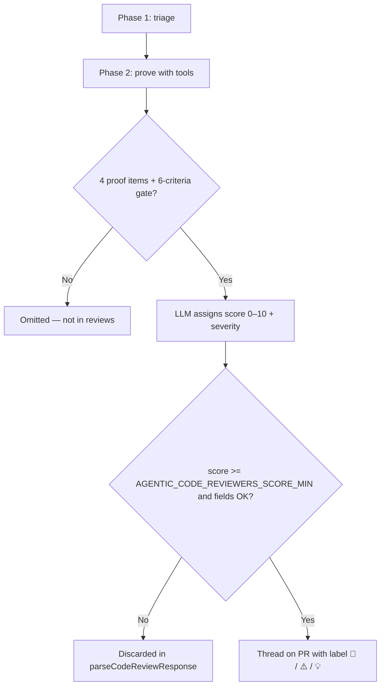

# Score and severity — Agentic Code Reviewers

> **Reference artifact** — score (0–10), severity and thread publication.
>
> See [`index.md`](index.md) for an overview.
> **Complements:** [`flow-analysis.md`](flow-analysis.md) · [`../skills/SYSTEM_PROMPT.md`](../skills/SYSTEM_PROMPT.md) · [`../AGENTS.md`](../AGENTS.md).
> **Variables:** `AGENTIC_CODE_REVIEWERS_SCORE_MIN` (default `6`).

---

## Overview

The runner **does not compute score by formula** (`score = f(lines, files, …)`). The flow is:

1. **LLM agent** — after proving the finding with tools, **assigns** `score`, `severity` and `developerAction` per the prompt rubrics.
2. **TypeScript** — **validates** whether the review is publishable (`isPublishableReview`); discards score below `AGENTIC_CODE_REVIEWERS_SCORE_MIN` (default **6**) or invalid contract.



**Practical conclusion:** the score is a **qualitative calibration** by the agent, not a number mechanically derived from the code. The runner only guarantees the **publishable range** (`AGENTIC_CODE_REVIEWERS_SCORE_MIN`–10, default **6**–10) and **JSON contract integrity**.

### `AGENTIC_CODE_REVIEWERS_SCORE_MIN` (configurable, opt-in)

| Channel | Example | Default if omitted |
|---------|---------|---------------------|
| Env | `AGENTIC_CODE_REVIEWERS_SCORE_MIN=4` | `6` |
| CLI | `--score-min 4` | `6` |

**Precedence:** `--score-min` > `AGENTIC_CODE_REVIEWERS_SCORE_MIN` > `6`.

**Compatibility:** existing pipelines/invocations that **do not** define `AGENTIC_CODE_REVIEWERS_SCORE_MIN` nor `--score-min` keep the historical threshold **6** — no breaking change. Only set `AGENTIC_CODE_REVIEWERS_SCORE_MIN` when you want to lower (e.g. `4`) or raise the rigor of what becomes an actionable thread.

The agent prompt (`src/agent/prompt.ts`) and TypeScript gates (`review-validation.ts`, `safe-outputs.ts`) use the same value loaded into `config.scoreMin`.

---

## Sources of truth

| Layer | File | Role |
|-------|------|------|
| Pipeline contract | `skills/SYSTEM_PROMPT.md` | score × severity × `developerAction` tables; advisory filter (effective gate: `AGENTIC_CODE_REVIEWERS_SCORE_MIN`, default 6) |
| Prompt orchestration | `src/agent/prompt.ts` | Phases 1–2; instruction to classify per System Prompt; injects `AGENTIC_CODE_REVIEWERS_SCORE_MIN` into the filter |
| Project criteria | `.agents/skills/code-review/SKILL.md` | Breaches, ABP/Angular checklist, 6–8 vs 9–10 calibration |
| Shared model | `.agents/skills/code-review/SKILL.md`, `skills/SYSTEM_PROMPT.md` | 0–10 scale and judgment axes |
| Safe Outputs | `src/ado/safe-outputs.ts` | `severity-score` uses the same `scoreMin` from `config` |
| Configuration | `src/config.ts` | `AGENTIC_CODE_REVIEWERS_SCORE_MIN` (env) / `--score-min` (CLI); `AGENTIC_CODE_REVIEWERS_ENGINE`; default `6` / `cursor-sdk` |
| LLM execution | `src/engine/` | `getEngine(config)` — `cursor-sdk` (`@cursor/sdk`) or `opencode` (`@opencode-ai/sdk`) |
| Programmatic gate | `src/ado/review-validation.ts` | `DEFAULT_SCORE_MIN = 6`, `MAX_PUBLISHABLE_SCORE = 10`; `isPublishableReview(review, scoreMin)` |
| Parser | `src/parser/review-response.ts` | Normalizes score; invalid severity → default `warning` |
| ADO formatting | `src/ado/format-thread.ts` | `🛑 CRITICAL` / `⚠️ WARNING` / `💡 SUGGESTION` prefix |
| Escalation | `src/ado/round-state.ts` | After `MAX_ROUNDS`, publishes only `critical` |

---

## Prerequisites before scoring

No finding receives a publishable score without going through the steps below. Failure at any step means the item **does not enter** `reviews` (or enters with score below `AGENTIC_CODE_REVIEWERS_SCORE_MIN` and is discarded by the gate).

### Phase 1 — Triage (immediate discard)

Discarded **without public score**:

- Nits, style, aesthetic preferences
- Theoretical alerts without executable runtime path
- Pre-existing code not touched by the diff
- In `*.html`: CSS/Tailwind/layout/grid (except security, permissions, bindings, validations)

### Phase 2 — Mandatory proof (4 items)

Documented in `analysis` and `impactPaths`. **All** required:

| # | Item | Meaning |
|---|------|---------|
| 1 | **Evidence read** | Files/symbols inspected via tools |
| 2 | **Executable failure scenario** | Concrete input/state triggering the problem |
| 3 | **Missing protection** | Tests/validations/invariants **do not** cover it (cite what you verified) |
| 4 | **Discards** | Alternative hypotheses considered and rejected |

Without all 4 → **do not include** in `reviews`.

### Agent gate (6 criteria)

Include in `reviews` only if **all** are true:

1. Evidence verified via tools
2. Executable runtime path
3. Missing protection confirmed (not assumed)
4. Material impact (security, data, business, CI)
5. `fileName` + `lineNumber > 0` on the most responsible changed line
6. Proportional fix (no overengineering)

### Judgment axes (5 questions)

Aligned to the `code-review` skill and System Prompt:

| # | Question | Typical effect on score |
|---|----------|---------------------------|
| 1 | Is the failure path executable and likely? | Without it → omit or score below `AGENTIC_CODE_REVIEWERS_SCORE_MIN` |
| 2 | Is it coherent with the work item / US plan? | Misalignment with AC → raise (8–9) |
| 3 | Does a protection already exist (test, validation, invariant)? | If yes → lower or omit (≤ 5) |
| 4 | Is the impact material (security, data, fiscal, business)? | Material + no protection → 8–10 |
| 5 | Is the requested fix proportional? | Nit → 0–5 |

---

## Score scale (0–10)

The agent uses an **ordinal** scale. There are no numeric weights per dimension — the score reflects the **integrated urgency/criticality** of the finding after the proofs above.

### Full scoring table

| Score | Band | Urgency | Meaning | Typical examples | Publishable? |
|-------|------|---------|---------|------------------|---------------|
| **0–2** | Discardable | Low | Nit, style, preference, cosmetic | Formatting, cosmetic rename, Tailwind layout with no functional impact | **No** |
| **3–5** | Discardable | Low | Theoretical or unlikely risk; already covered | "Could be better" without executable failure; existing invariant/test covers the scenario | **No** |
| **6** | Threshold | High (minimum) | Real problem with material impact, more localized | Improvement with proven impact; specific edge case | **Yes** |
| **7** | Publishable | High | Probable bug or regression in a concrete scenario | Fragile validation, enum compared fragilely, partially broken contract | **Yes** |
| **8** | Publishable | High | Probable bug with clear impact | Missing `[Authorize]`, `.Result`/`.Wait()` in async, `atob` without base64 validation, missing `*abpPermission`, probable N+1 | **Yes** |
| **9** | Publishable | Critical | Severe failure with high operational impact | Violated business invariant, data loss/corruption, evidently unimplemented acceptance criterion | **Yes** |
| **10** | Publishable | Max critical | Exploitable or merge blocker | DELETE without auth, XSS (`[innerHTML]`), secrets in code, dangerous defaults in write flow (`Guid.Empty`, `DateTime.MinValue`) | **Yes** |

### Quick reference (code-review / System Prompt)

| Score | Summary |
|-------|---------|
| 0–2 | Nit / style |
| 3–5 | Low risk or improbable warning |
| 6–8 | Probable bug, regression, broken contract |
| 9–10 | Critical — security, data, contract, business invariant |

---

## Severity classification

**Severity** (`critical` | `warning` | `suggestion`) is assigned by the agent **along** with the score. It describes the **type of impact**; it does not replace the score.

### severity × when to use × typical score table

Per `skills/SYSTEM_PROMPT.md`:

| `severity` | When to use | Typical `score` | Label on ADO thread |
|------------|-------------|------------------|---------------------|
| **`critical`** | Security; data loss or corruption; violation of a **business invariant** | **9–10** | `🛑 **CRITICAL:**` |
| **`warning`** | Probable bug; regression; broken contract; missing auth/permission | **6–8** | `⚠️ **WARNING:**` |
| **`suggestion`** | Material improvement with proven impact (**rare** — omit if nit) | **6–7** | `💡 **SUGGESTION:**` |

### Additional per-layer rules

| Context | Rule |
|---------|------|
| **Backend (.cs)** | Dangerous defaults (`Guid.Empty`, `DateTime.MinValue`, `0` when the domain requires a value) → generally **`critical`** (score 9–10) |
| **Security** | Missing auth, XSS, injection, secrets → **`critical`** |
| **Performance** | `.Result`/`.Wait()`, material N+1 → **`warning`** (6–8); data corruption → **`critical`** |
| **Angular (*.html)** | **Never** `suggestion` — only `critical` or `warning` |
| **Work items (legacy prompt)** | Evident AC missing → `critical`; partial implementation → `warning` |

### Priority breaches (code-review skill)

Advisory mapping severity ↔ defect type:

| Defect type | Usual severity | Usual score |
|-------------|-----------------|--------------|
| DELETE/mutation without `[Authorize]` or ABP permission | `critical` | 9–10 |
| `[innerHTML]` / XSS | `critical` | 9–10 |
| Business invariant violation (e.g. delete with orphaned references) | `critical` | 9–10 |
| `.Result` / `.Wait()` in async method | `warning` | 7–8 |
| `Guid.Empty` / `DateTime.MinValue` not rejected | `warning` or `critical`\* | 8–10 |
| Destructive button without `*abpPermission` | `warning` | 7–8 |
| `atob()` without validating base64 | `warning` | 7–8 |
| Material EF Core N+1 | `warning` | 7–8 |
| Material clean-code improvement | `suggestion` | 6–7 |

\* `critical` when the invalid default may persist corrupted data or violate a fiscal/financial rule.

---

## Score × severity × developerAction

### Action matrix

| Score | `developerAction` | Thread on PR? | Meaning for the dev |
|-------|-------------------|---------------|--------------------|
| 0–5 | `resolve-comment` | **No** | Agent's internal classification — item discarded by the gate |
| 6–8 | `fix-code` | **Yes** | Fix in code |
| 9–10 | `fix-code` | **Yes** | Fix in code (high priority) |
| ≥ 6 + product conflict | `escalate` | **Yes** | Human decision (ambiguous WI/plan) |

> **`resolve-comment`** in the reviewer contract means "do not publish a thread". New reviews should **never** use `resolve-comment` intending to publish — the gate rejects it.

### score ↔ severity relationship (guidance, not a hard rule)

TypeScript does **not** rewrite severity based on score. Calibration is the agent's responsibility:

| Expected combination | Atypical combination (accepted if score >= AGENTIC_CODE_REVIEWERS_SCORE_MIN) |
|----------------------|------------------------------------------------------------------------------|
| score 9–10 + `critical` | score 9 + `warning` (runner accepts) |
| score 6–8 + `warning` | score 8 + `critical` (runner accepts) |
| score 6–7 + `suggestion` | score 7 + `critical` (runner accepts) |

---

## Programmatic gate (how the runner "calculates" what to publish)

Implemented in `src/ado/review-validation.ts` + config in `src/config.ts`:

```typescript
export const DEFAULT_SCORE_MIN = 6; // used when AGENTIC_CODE_REVIEWERS_SCORE_MIN / --score-min omitted
export const MAX_PUBLISHABLE_SCORE = 10;

// isPublishableReview(review, scoreMin = DEFAULT_SCORE_MIN)
```

### Publication conditions (`isPublishableReview`)

| Field | Rule |
|-------|------|
| `score` | Finite number, **AGENTIC_CODE_REVIEWERS_SCORE_MIN ≤ score ≤ 10** (default: **6 ≤ score ≤ 10**) |
| `fileName` | Non-empty |
| `lineNumber` | Integer **> 0** |
| `severity` | `critical` \| `warning` \| `suggestion` |
| `comment` | Non-empty |
| `analysis` | Non-empty |
| `impactPaths` | Non-empty array; each path non-empty |
| `developerAction` | `fix-code` \| `escalate` — **never** `resolve-comment` |
| `suggestedFix` | Optional |

Reviews that fail are discarded in `parseCodeReviewResponse` **before** the ADO POST. Typical message:

> Policy: N review(s) discarded — score < AGENTIC_CODE_REVIEWERS_SCORE_MIN, missing required fields or invalid contract.

(With the default, equivalent to `score < 6`.)

### Parser normalization

In `src/parser/review-response.ts`:

- Missing or non-numeric `score` → review **not publishable**
- Invalid `severity` → default **`warning`** (but still must pass the full gate)

---

## What happens after classification

| Use | Behavior |
|-----|----------|
| **Thread body** | `format-thread.ts` — prefix by severity + `<details>` block with `Score: N/10` |
| **Azure DevOps pipeline** | `pipeline-logging.ts` — `critical` → `##vso[task.logissue type=error]`; others → `type=warning` |
| **Positive summary** | At end of review, only if zero bot active/pending threads; fixed runner message |
| **Escalation** | `currentRound > AGENTIC_CODE_REVIEWERS_MAX_ROUNDS` (default 10) + open issues → publishes **only** `critical`; suppresses new `warning`/`suggestion` |
| **Dedup** | Key `normalizedFile\|line:N` — same line does not generate a duplicate thread |

---

## Calibrated examples (seed fixtures)

Reference: `fixtures/seed/sample-evaluate-output.txt` and `fixtures/seed/expected-scenarios.json` (`minScore: 6` per scenario).

| ID | Defect | Score | Severity | Calibration rationale |
|----|--------|-------|----------|------------------------|
| SEED-B1 | DELETE without `[Authorize]` | **9** | `critical` | Destructive operation exposed — security |
| SEED-B2 | `.Result` in async | **8** | `warning` | Probable deadlock — real bug, not immediate corruption |
| SEED-B3 | `Guid.Empty` not rejected | **8** | `warning` | Localized dangerous default |
| SEED-F2 | Button without `*abpPermission` | **8** | `warning` | Missing UI authorization |
| SEED-F3 | `atob` without validating base64 | **8** | `warning` | Runtime failure with invalid payload |

---

## Calibration in doubt

Explicit rules from `SYSTEM_PROMPT.md`:

| Situation | Behavior |
|-----------|----------|
| Doubt whether the finding **is real** | **Silence** — do not publish |
| **Proven** finding that passes the gate | **Publish** — do not omit to "avoid clutter" |
| PR with no new issues | `"reviews": []` for findings ≥ scoreMin; summary on PR only when zero bot threads at end of review |

Anti-loop objective: **completeness in the same round** — list all material findings at once (score ≥ `AGENTIC_CODE_REVIEWERS_SCORE_MIN`, default 6), do not reserve for future rounds.

---

## FAQ

### Is there a formula or weight per dimension?

**No.** There is no point sum of "security +2, performance +1", etc. The agent integrates evidence, impact and probability into a single integer 0–10.

### Does the runner fix inconsistent score or severity?

**No.** It only validates the range `AGENTIC_CODE_REVIEWERS_SCORE_MIN`–10 (default 6–10) and required fields. Invalid severity becomes `warning` in the parser; score outside the range discards the item.

### Can I change the threshold without breaking old pipelines?

**Yes.** `AGENTIC_CODE_REVIEWERS_SCORE_MIN` and `--score-min` are **optional**. Omitting both keeps the default **6** — identical behavior to previous versions.

### Score 6 vs 8 vs 10 — what's the practical difference?

| Score | For the developer |
|-------|----------------------|
| 6 | Fix — material impact, lower relative urgency |
| 8 | Fix — probable bug or clear contract failure |
| 10 | Fix with priority — security, data, or merge blocker risk |

All produce threads; the pipeline **does not** block the build by score (exit 0).

### Why don't scores below the minimum become threads?

With the default `AGENTIC_CODE_REVIEWERS_SCORE_MIN=6`, scores 0–5 are not published — avoids noise (nits, style, unproven alerts). **Lowering** `AGENTIC_CODE_REVIEWERS_SCORE_MIN` (e.g. `4`) makes scores 4–5 eligible; **omitting** the variable changes nothing relative to historical behavior.

---

## Cross-references

| Document | Related content |
|-----------|--------------------|
| [`flow-analysis.md`](flow-analysis.md) | Score gate, publication policies, escalation |
| [`two-phase-execution-model.md`](two-phase-execution-model.md) | Why classification runs in a single agent call |
| [`workflows.md`](workflows.md) | All execution paths |
| [`../README.md`](../README.md) | Thread format, JSON output, `MAX_ROUNDS` |
| [`../SEED-ISSUES.md`](../SEED-ISSUES.md) | Test scenarios with expected `minScore` |