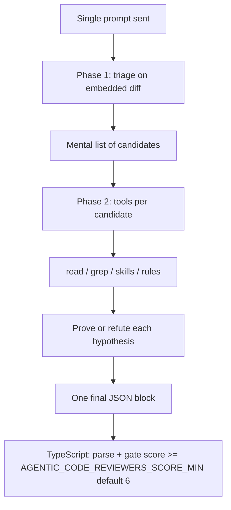

# Execution model — two-phase analysis (single call)

> **Reference artifact** — explains how the **agentic-code-reviewers** implements the two review phases (triage → investigation) and why we use a **single agent call** instead of multiple agents or separate steps.
>
> See [`index.md`](index.md) for an overview. Complements [`flow-analysis.md`](flow-analysis.md) (full operational flow).
> **Last revision:** Jun/2026.

---

## Executive summary

| Question | Answer |
|----------|--------|
| Are two prompts sent? | **No** — one prompt built by `buildAgentPrompt()`. |
| Are two agent calls made? | **No** — one `agent.send()` per review. |
| Are the phases "mental"? | **Partially** — Phase 1 is mental output; Phase 2 uses real tools in the same session. |
| When does the JSON come out? | **Once**, at the end, after both phases. |
| Is it worth splitting into 2 agents? | **Not by default** — the single call is the right choice for this use case. |

---

## How it works in practice

### 1. One assembly, one send

`runner.ts` builds the complete prompt and delegates to the injected engine (`getEngine(config)`):

```typescript
// src/agent/runner.ts
export async function runCodeReviewAgent(config, context, engine, logger) {
  const prompt = buildAgentPrompt(config, context);
  return engine.run(config, { name: '...', prompt }, logger);
}
```

In the `cursor-sdk` engine this becomes `Agent.create()` + `agent.send()` — **a single run** (`src/engine/cursor-sdk/stream.ts`).

`index.ts` calls `runCodeReviewAgent` **once** per review (or omits the agent if the diff is empty).

### 2. The prompt already carries both phases

`buildAgentPrompt()` concatenates everything into a single string:

| Block | Origin |
|-------|--------|
| System prompt | `skills/SYSTEM_PROMPT.md` |
| Harness | `skills/CODE_REVIEW.md` |
| Git, diff, rules, ADO context | `src/agent/prompt.ts` |
| **2-phase workflow** | `buildTwoPhaseWorkflow()` |
| Final verdict | `buildVerdictAndAdoPolicy()` |

The phases are described in `buildTwoPhaseWorkflow()` (`src/agent/prompt.ts`):

- **Phase 1 — Triage:** candidate map anchored to changed lines; immediate discard of nits, style, theory without executable path.
- **Phase 1 mental output:** list `(file, line, brief hypothesis)` — **no intermediate JSON**.
- **Phase 2 — Investigation:** prove or refute each candidate with tools; only the proven ones enter `reviews`.

Explicit instruction: *"Complete **the entire Phase 1** before starting Phase 2. Do not publish a finding without going through both."*

### 3. What the agent does during the run (same session)



- **Phase 1:** uses the pre-loaded diff (or `git diff` via tools) to map candidates on changed lines.
- **Phase 2:** for each candidate, uses tools (`read`, `grep`, code-review skill, project rules) to prove or discard.
- **Output:** **only at the end** — a ```` ```json ```` block with `reviews`, `resolvedThreads`, `reviewSummary`.

During the run, `thinking`, `tool_call` and `assistant` events appear — all in the same conversation.

### 4. Second "layer" of phases (not another agent)

The operational doc speaks of a **two-layer decision**:

1. **Agent (LLM)** — triage + proof + filter score &lt; `AGENTIC_CODE_REVIEWERS_SCORE_MIN` in the prompt (value in **execution context** and Phase 2.4; default 6).
2. **TypeScript** — `isPublishableReview(review, scoreMin)` + Safe Outputs (`severity-score` with the same `scoreMin`) discard what doesn't pass before posting.

This is deterministic post-processing of the JSON, **not** a second LLM round. See [`flow-analysis.md`](flow-analysis.md) and `src/ado/review-validation.ts`.

---

## Analysis: single call vs. multi-agent

### Why the single call works well here

**1. The phases share the same cognitive context.**

Phase 2 depends on Phase 1 hypotheses. In a single run the agent keeps diff, candidates, rules read via tools and reasoning in the **same context window**. With separate agents the Phase 1 output would need to be re-serialized and the context rebuilt — more tokens and loss of nuance ("why did I find this suspicious?").

**2. Tools already provide what a "step 2" would.**

The classic multi-step gain is forcing evidence before the verdict. Phase 2 **is exactly that**: `read`, `grep`, skill, rules — prove or refute each candidate with the 4 mandatory items documented in `analysis` and `impactPaths`.

**3. Precision already has a deterministic gate.**

The final filter is **not LLM** — it's TypeScript (`isPublishableReview`, score `AGENTIC_CODE_REVIEWERS_SCORE_MIN`–10 default 6, required fields). This is cheaper, reproducible and testable (`npm test`) than a second "judge" agent.

**4. Cost and latency.**

One run = one `Agent.create` + `agent.send`. Two agents = two initializations, two contexts, more wall-clock time — relevant in a per-push PR pipeline.

### Where the current design is fragile

| Risk | Symptom | Current mitigation |
|------|---------|--------------------|
| Model "skips" Phase 1 | Shallow findings, inconsistent `impactPaths` | Explicit instruction + gate requires non-empty `impactPaths` |
| Instruction dilution (long prompt) | Ignores rules in the middle of the prompt | System prompt + skill + phases + ADO in one string — **most fragile point** |
| Large PR → shortcut | Reviews only a few files | Note `large PR` instructing to run over all eligible files |
| No checkpoint between phases | Can't inspect Phase 1 candidates | Phase 1 is "mental output", not observable |

The critical point is the **monolithic prompt**: reliability of following instructions drops as the prompt grows.

### When 2 agents / multiple steps would be worth it

Change the design **only if** one of these becomes a **measured** problem:

1. **Persistent false positives despite the gate** → separate "critic" agent (generator/critic) receiving candidate reviews + diff and only confirming/dropping. Try hardening the prompt and deterministic gate first.

2. **Context window blowing up on large PRs** → natural split **by file/chunk**, not by phase: N parallel runs (one per file group) + aggregation. Scales better and still parallelizes.

3. **Observability of Phase 1 candidates** → expose triage as intermediate JSON (same agent, via `resume`) for debugging why something didn't become a thread.

---

## Recommendations (cost-benefit order)

1. **Cheap (keep):** invest in the deterministic gate (TypeScript) — precision guaranteed without extra LLM cost.
2. **Medium:** if large PRs are common, **parallelize by file** (multiple runs), not by phase.
3. **Expensive / only if needed:** dedicated *critic* agent only for `critical` reviews, as a second opinion before posting.

**Conclusion:** the quality bottleneck in a reviewer is not "too many phases in the same agent", but **evidence + gate**. The current design nails this. Splitting into 2 agents adds cost and orchestration complexity without attacking the main risk (monolithic prompt), which is better addressed by shortening/structuring the prompt and reinforcing the deterministic gate.

---

## Related code map

| Module | Role |
|--------|------|
| `src/agent/prompt.ts` | Builds single prompt; `buildTwoPhaseWorkflow()` |
| `src/agent/runner.ts` | `buildAgentPrompt` + `runAgentStream` |
| `src/engine/cursor-sdk/stream.ts` | `Agent.create`, `agent.send`, stream, `run.wait()` (engine `cursor-sdk`) |
| `src/engine/opencode/stream.ts` | OpenCode session via `@opencode-ai/sdk`: prompt, SSE, embedded server (`event-stream.ts`, `server.ts`) |
| `src/index.ts` | Orchestration; one call to `runCodeReviewAgent` |
| `src/ado/review-validation.ts` | Deterministic post-LLM gate |
| `skills/SYSTEM_PROMPT.md` | JSON contract and publication filter |
| `run.sh` | Remote/local runner; see [README](../README.md) and [`workflows.md`](workflows.md) |
| `docs/flow-analysis.md` | Full operational flow (ADO context, parser, gate, CI) |

---

## References

| Resource | Path |
|---------|------|
| Operational flow | [`flow-analysis.md`](flow-analysis.md) |
| All execution paths | [`workflows.md`](workflows.md) |
| README | [`../README.md`](../README.md) |
| Agent instructions | [`../AGENTS.md`](../AGENTS.md) |