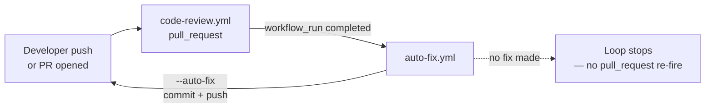
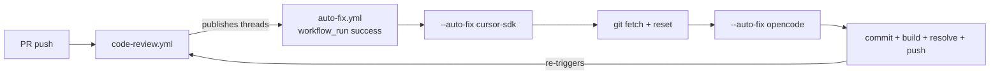

# Execution Paths — Agentic Code Reviewers

> Every way the runner can be invoked: local dry-runs, CI pipelines on Azure DevOps and GitHub (self and consumer repos), the auto-fix loop, the IDE skills, and the engine choice (`cursor-sdk` vs `opencode`).
>
> Read [`index.md`](index.md) first for a topic overview. See [`flow-analysis.md`](flow-analysis.md) for the in-process flow.

---

## Path selector

```mermaid
flowchart TD
    Q[Where are you running?] --> A[Local CLI dry-run]
    Q --> B[Azure Pipelines]
    Q --> C[GitHub Actions — this repo]
    Q --> D[GitHub Actions — consumer repo]
    Q --> E[IDE / Cursor]
    A --> A1[npm run review -- --dry-run<br/>or run.sh --local]
    B --> B1[azure-pipelines template<br/>+ run.sh curl]
    C --> C1[code-review.yml matrix<br/>run.sh --local]
    C --> C2[auto-fix.yml workflow_run<br/>--auto-fix]
    D --> D1[reusable review-remote.yml]
    D --> D2[curl run.sh @release]
    D --> D3[two-workflow loop<br/>code-review + auto-fix]
    E --> E1[/code-review-self<br/>read-only]
    E --> E2[/megabrain<br/>iterative threads]
    E --> E3[/solve-pr<br/>fix+push GitHub]
```

---

## 1. Local CLI (dry-run)

**Where:** developer machine, currently checked-out branch.

```bash
# cursor-sdk
npm run review -- --dry-run --engine cursor-sdk --model composer-2.5

# opencode (embedded server)
npm run review -- --dry-run --engine opencode --model opencode-go/deepseek-v4-flash

# custom target + uncommitted changes
npm run review -- --dry-run --target-branch refs/heads/develop --include-uncommitted

# run.sh shortcut (local mode)
bash run.sh --local --dry-run --gh --pr-id 42 --source-branch feat/x --target-branch main
```

**Behavior:** uses the current branch as source; diff is `target...HEAD` (plus uncommitted if `--include-uncommitted`). No HTTP calls unless you pass `--pr-id` + provider context. Exit `0` unless fatal.

**Requirements:** `CURSOR_API_KEY` (`cursor-sdk`) or `OPENCODE_API_KEY`/`auth.json` (`opencode`). Optional `AGENTIC_CODE_REVIEWERS_AZURE_DEVOPS_PAT` for ADO context tests.

**Seed E2E:** `npm run test:seed` — installs defect fixtures, runs dry-run, validates detection against [`SEED-ISSUES.md`](../SEED-ISSUES.md), uninstalls. See [`index.md`](index.md) § 11.

---

## 2. Azure Pipelines (Azure DevOps)

**Template:** [`azure-pipelines-cursor-code-review.yml`](../azure-pipelines-cursor-code-review.yml). Copy to the target repo root.

### Consumer via cURL + `run.sh`

```yaml
- script: |
    curl -fsSL https://raw.githubusercontent.com/jpolvora/agentic-code-reviewers/release/run.sh | bash -s -- \
      --engine cursor-sdk --model composer-2.5 \
      --ado --org "MyOrg" --project "MyProject" --repo "MyRepo" \
      --pr-id $(System.PullRequest.PullRequestId)
  env:
    CURSOR_API_KEY: $(CURSOR_API_KEY)
    SYSTEM_ACCESSTOKEN: $(System.AccessToken)
  displayName: 'Agentic Review (Cursor SDK)'
```

(For `opencode`, replace `CURSOR_API_KEY` with `OPENCODE_API_KEY` and `--engine opencode --model opencode-go/deepseek-v4-flash`.)

### Auto-detected pipeline variables

| Variable | Source |
|----------|--------|
| `SYSTEM_PULLREQUEST_SOURCEBRANCH` / `..._TARGETBRANCH` | PR trigger |
| `SYSTEM_PULLREQUEST_PULLREQUESTID` | PR trigger |
| `SYSTEM_COLLECTIONURI` / `SYSTEM_TEAMPROJECT` / `BUILD_REPOSITORY_NAME` | Build context |
| `SYSTEM_ACCESSTOKEN` | OAuth (must enable **Allow scripts to access the OAuth token**) |

### Prerequisites

1. Variable group `vg-agentic-code-reviewers` with `CURSOR_API_KEY` (and/or `OPENCODE_API_KEY`).
2. Build Service has **Contribute to pull requests**.
3. OAuth token enabled on the job.
4. Branch policy: Build Validation pointing at the pipeline.
5. Agent pool `ubuntu-latest` + Node 22.13+; `fetchDepth: 0` + `persistCredentials: true`.

### Pipeline visibility

With `TF_BUILD=true` the runner emits `##vso[task.logissue]` per finding and `##vso[task.uploadsummary]` with a markdown summary attached to the build. Exit `0` regardless of findings.

---

## 3. GitHub Actions — this repository (`code-review.yml`)

[`code-review.yml`](../.github/workflows/code-review.yml) triggers on `pull_request` to `main` and on `workflow_dispatch`. It runs one **matrix** job per engine via `bash run.sh --local --gh …`.

| Check on PR | Engine | Model | Comment tag |
|-------------|--------|-------|-------------|
| Review (cursor-sdk) | `@cursor/sdk` | `composer-2.5` | `Agentic Code Reviewer cursor-sdk` |
| Review (opencode) | `@opencode-ai/sdk` | `opencode-go/deepseek-v4-flash` | `Agentic Code Reviewer opencode` |

**Execution mode:** `parallel` by default; `sequential` via `workflow_dispatch` input or repo variable `AGENTIC_CODE_REVIEWERS_EXECUTION_MODE` (`max-parallel: 1`). Each job has its own `concurrency` group (`review-<engine>-#N`) so re-runs of one engine don't cancel the other. All jobs use `continue-on-error: true` — agent failures don't block the merge.

This repo sets `AGENTIC_CODE_REVIEWERS_SCORE_MIN: '1'` and `AGENTIC_CODE_REVIEWERS_REVIEW_SELF: 'true'` so the runner reviews itself with the lowest threshold. Consumer repos keep the default **6**.

### Merge ruleset (`main`)

[`.github/rulesets/agentic-main.json`](../.github/rulesets/agentic-main.json):

- Changes to `main` only via PR (no direct push, no force-push, no deletion)
- All review threads resolved before merge (`required_review_thread_resolution`)

The runner's `continue-on-error: true` check **does not** block merge by itself — only open bot threads on the PR block it. Apply after editing with `bash scripts/apply-rulesets.sh`.

### Release (`release.yml`)

On merge to `main`: `npm test` → build all engines → validate `dist/engine/` → bump patch (`[skip ci]`) → publish runtime artifacts to the `release` branch (consumed by `run.sh`).

Required secrets: `CURSOR_API_KEY`, `OPENCODE_API_KEY`. Optional `AGENTIC_CODE_REVIEWERS_GITHUB_TOKEN` (PAT) for thread resolution.

### Required secrets

| Secret | Job |
|--------|-----|
| `CURSOR_API_KEY` | `cursor-sdk` review, `cursor-sdk` auto-fix |
| `OPENCODE_API_KEY` | `opencode` review, `opencode` auto-fix |
| `AGENTIC_CODE_REVIEWERS_GITHUB_TOKEN` | PAT — required to call `resolveReviewThread`; falls back to `github.token` |

---

## 4. GitHub Actions — consumer repos

### Option A — reusable workflow (recommended)

[`review-remote.yml`](../.github/workflows/review-remote.yml) is the conventional reusable. Copy [`examples/consumer-github-workflow.yml`](../examples/consumer-github-workflow.yml) into `.github/workflows/code-review.yml`:

```yaml
name: Agentic Code Review
on:
  pull_request:
    branches: [main]
permissions:
  pull-requests: write
  contents: read
jobs:
  review:
    uses: jpolvora/agentic-code-reviewers/.github/workflows/review-remote.yml@release
    with:
      engine: cursor-sdk            # or opencode
      model: ''                     # empty = engine default
      score_min: '6'                # optional; omit = default 6
    secrets:
      CURSOR_API_KEY: ${{ secrets.CURSOR_API_KEY }}
      # Opencode:
      # OPENCODE_API_KEY: ${{ secrets.OPENCODE_API_KEY }}
      AGENTIC_CODE_REVIEWERS_GITHUB_TOKEN: ${{ secrets.AGENTIC_CODE_REVIEWERS_GITHUB_TOKEN }}
```

The reusable workflow downloads `run.sh` from the configured `release` branch, clones artifacts and invokes `--gh` against the runner checkout.

### Option B — cURL + `run.sh`

```yaml
- uses: actions/checkout@v5
  with: { fetch-depth: 0 }
- uses: actions/setup-node@v6
  with: { node-version: 22 }
- name: Run remote reviewer (Cursor SDK)
  env:
    CURSOR_API_KEY: ${{ secrets.CURSOR_API_KEY }}
    AGENTIC_CODE_REVIEWERS_GITHUB_TOKEN: ${{ secrets.AGENTIC_CODE_REVIEWERS_GITHUB_TOKEN || github.token }}
  run: |
    curl -fsSL https://raw.githubusercontent.com/jpolvora/agentic-code-reviewers/release/run.sh | bash -s -- \
      --engine cursor-sdk --model composer-2.5 \
      --gh --pr-id "${{ github.event.pull_request.number }}" \
      --source-branch "${{ github.head_ref }}" \
      --target-branch "${{ github.event.pull_request.base.ref }}"
```

For OpenCode replace the credential env and `--engine`/`--model` accordingly (see [`../README.md`](../README.md) § GitHub Actions consumer).

> Use the **`release`** branch in the `run.sh` URL — it carries compiled artifacts aligned with the script. The `main` branch contains TypeScript source.

### 4.1 Setting up review + auto-fix (two-workflow loop)

For a complete convergence loop (review → fix → re-review until clean), the consumer repo needs **two workflow files** chained via `workflow_run` + `pull_request synchronize`:



**Why two files?** The auto-fix engine (`opencode`) differs from the review engine (`cursor-sdk`), so each runs in a separate workflow with its own credentials and timeout. The `workflow_run` event bridges them.

#### File 1: `.github/workflows/code-review.yml`

```yaml
name: Agentic Code Review

on:
  pull_request:
    types: [opened, synchronize, reopened]

permissions:
  contents: read
  pull-requests: write

jobs:
  review:
    runs-on: ubuntu-latest
    steps:
      - uses: actions/checkout@v5
        with: { fetch-depth: 0 }
      - uses: actions/setup-node@v6
        with: { node-version: 22 }

      - name: Run code reviewer
        env:
          CURSOR_API_KEY: ${{ secrets.CURSOR_API_KEY }}
          AGENTIC_CODE_REVIEWERS_GITHUB_TOKEN: ${{ secrets.AGENTIC_CODE_REVIEWERS_GITHUB_TOKEN }}
          AGENTIC_CODE_REVIEWERS_ENGINE: cursor-sdk
          AGENTIC_CODE_REVIEWERS_MODEL: composer-2.5
        run: |
          git checkout -B "${{ github.head_ref }}"
          curl -fsSL https://raw.githubusercontent.com/jpolvora/agentic-code-reviewers/release/run.sh | bash -s -- \
            --gh \
            --source-branch "refs/heads/${{ github.head_ref }}" \
            --target-branch "refs/heads/${{ github.event.pull_request.base.ref }}"

      - name: Check for active threads
        env:
          AGENTIC_CODE_REVIEWERS_GITHUB_TOKEN: ${{ secrets.AGENTIC_CODE_REVIEWERS_GITHUB_TOKEN }}
        run: |
          ACTIVE_THREADS=$(node .agents/skills/solve-pr/scripts/fetch_threads.cjs ${{ github.event.pull_request.number }} --json | jq '.activeThreads | length')
          echo "Active threads: $ACTIVE_THREADS"
          if [ "$ACTIVE_THREADS" -gt 0 ]; then
            echo "Unresolved threads found."
            exit 1
          fi
```

The final step exits 1 when threads remain — this makes the workflow conclusion `failure`, which is intentional: auto-fix must fire on *both* `success` and `failure` conclusions to converge.

#### File 2: `.github/workflows/auto-fix.yml`

```yaml
name: Agentic Auto Fix

on:
  workflow_run:
    workflows: ["Agentic Code Review"]
    types:
      - completed
  workflow_dispatch:
    inputs:
      pr_number:
        description: "PR number"
        required: true
        type: string

permissions:
  contents: write
  pull-requests: write

jobs:
  auto-fix:
    concurrency:
      group: auto-fix-${{ github.event.workflow_run.pull_requests[0].number || github.event.inputs.pr_number }}
      cancel-in-progress: false
    runs-on: ubuntu-latest
    if: ${{ github.event.workflow_run.conclusion == 'success' || github.event.workflow_run.conclusion == 'failure' }}
    steps:
      - name: Extract PR info
        id: pr-info
        env:
          GH_TOKEN: ${{ secrets.AGENTIC_CODE_REVIEWERS_GITHUB_TOKEN }}
        run: |
          PR_NUMBER="${{ github.event.workflow_run.pull_requests[0].number }}"
          HEAD_BRANCH="${{ github.event.workflow_run.pull_requests[0].head.ref }}"
          if [ -z "$PR_NUMBER" ] || [ "$PR_NUMBER" = "null" ]; then
            HEAD_SHA="${{ github.event.workflow_run.head_sha }}"
            PR_DATA=$(gh api "repos/${{ github.repository }}/commits/$HEAD_SHA/pulls" --jq '.[0]')
            PR_NUMBER=$(echo "$PR_DATA" | jq -r '.number')
            HEAD_BRANCH=$(echo "$PR_DATA" | jq -r '.head.ref')
          fi
          echo "pr_number=$PR_NUMBER" >> "$GITHUB_OUTPUT"
          echo "source_branch=$HEAD_BRANCH" >> "$GITHUB_OUTPUT"

      - uses: actions/checkout@v5
        with:
          fetch-depth: 0
          ref: ${{ steps.pr-info.outputs.source_branch }}
      - uses: actions/setup-node@v6
        with: { node-version: 22 }

      - name: Check for active threads
        id: check-threads
        env:
          AGENTIC_CODE_REVIEWERS_GITHUB_TOKEN: ${{ secrets.AGENTIC_CODE_REVIEWERS_GITHUB_TOKEN }}
        run: |
          ACTIVE_THREADS=$(node .agents/skills/solve-pr/scripts/fetch_threads.cjs ${{ steps.pr-info.outputs.pr_number }} --json | jq '.activeThreads | length')
          echo "active_threads_count=$ACTIVE_THREADS" >> "$GITHUB_OUTPUT"
          echo "Active threads: $ACTIVE_THREADS"

      - name: Run auto-fix
        if: ${{ steps.check-threads.outputs.active_threads_count != '0' }}
        env:
          AGENTIC_CODE_REVIEWERS_GITHUB_TOKEN: ${{ secrets.AGENTIC_CODE_REVIEWERS_GITHUB_TOKEN }}
          AGENTIC_CODE_REVIEWERS_ENGINE: opencode
          AGENTIC_CODE_REVIEWERS_MODEL: opencode-go/deepseek-v4-flash
          OPENCODE_API_KEY: ${{ secrets.OPENCODE_API_KEY }}
        run: |
          curl -fsSL https://raw.githubusercontent.com/jpolvora/agentic-code-reviewers/release/run.sh | bash -s -- \
            --gh \
            --pr-id "${{ steps.pr-info.outputs.pr_number }}" \
            --source-branch "refs/heads/${{ steps.pr-info.outputs.source_branch }}" \
            --target-branch "refs/heads/${{ github.event.workflow_run.pull_requests[0].base.ref }}" \
            --auto-fix
```

#### How the loop converges

| Step | Event | What happens |
|------|-------|-------------|
| 1 | `pull_request` push | `code-review.yml` runs the reviewer, posts threads, exits 1 |
| 2 | `workflow_run` completed | `auto-fix.yml` fires (accepts both success and failure) |
| 3 | `--auto-fix` | Runner applies fixes, commits (`fix(#N): auto-fix…`), pushes |
| 4 | `pull_request` synchronize | Push re-fires `code-review.yml` — threads from fixed issues are gone, new ones may appear |
| 5 | Loop | Step 2 → 4 repeats until `check-threads` reports 0 (auto-fix skipped, loop ends) or no progress between iterations |

**Loop stops when:** all threads resolved (clean), auto-fix makes no change (no push → no synchronize → no re-fire), or `AGENTIC_CODE_REVIEWERS_MAX_ROUNDS` (default 10) escalates to human handoff.

#### Critical requirements

| Requirement | Why |
|-------------|-----|
| **PAT token** as `AGENTIC_CODE_REVIEWERS_GITHUB_TOKEN` | `github.token` cannot call `resolveReviewThread` and its push won't re-trigger `pull_request` workflows. Use a classic `repo` or fine-grained PAT. |
| **Both conclusion gates** (`success || failure`) | Code review workflow exits 1 when threads exist (conclusion = failure). Auto-fix must fire regardless. |
| **`concurrency.cancel-in-progress: false`** (auto-fix) | If a developer pushes during an auto-fix run, both should complete without cancellation. |
| **Node 22+** with `fetch-depth: 0` | Required by the runner (git diff + runtime). |
| **`curl \| bash` uses `release` branch** | `main` has TypeScript source; `release` carries compiled artifacts (`dist/`). |

#### Tuning

| Parameter | File | Effect |
|-----------|------|--------|
| `AGENTIC_CODE_REVIEWERS_SCORE_MIN` | env on review step | Lower = more threads posted (try `4` for verbose) |
| `AGENTIC_CODE_REVIEWERS_ENGINE` + `_MODEL` | per workflow | Swap `cursor-sdk` ↔ `opencode`; each can have a different model |
| `AGENTIC_CODE_REVIEWERS_AUTO_FIX_BUILD_COMMAND` | env on auto-fix step | Build command before push (default: `npm test` or `npm run build`). Set empty to skip build gate |
| `--max-rounds N` | CLI on review | Cap escalation rounds. Stale threads after N rounds stay open for human review |

#### Initial setup checklist

1. Add `code-review.yml` and `auto-fix.yml` to `.github/workflows/`.
2. Set repository secrets:
   - `CURSOR_API_KEY` (review engine)
   - `OPENCODE_API_KEY` (auto-fix engine)
   - `AGENTIC_CODE_REVIEWERS_GITHUB_TOKEN` (PAT with `repo` or `pull-requests: read/write`)
3. On the PR branch, run `node -e "require('child_process').execSync('npm init -y')"` to create a minimal `package.json` if none exists (required for `setup-node` caching).
4. Verify: open a PR → code review posts threads → auto-fix fires → pushes fix → code review re-runs → converges or stops.

---

## 5. Auto-fix loop (this repo — `auto-fix.yml`)

[`auto-fix.yml`](../.github/workflows/auto-fix.yml) triggers on `workflow_run` after **Agentic Code Review** succeeds (also accept `workflow_dispatch`). A single job runs `cursor-sdk` then `opencode` sequentially (`--auto-fix`), `git fetch + reset` between engines, `concurrency` per PR, and a final step that fails the job if **every** configured engine failed.



**Cycle:**

1. Reviewer posts threads.
2. `workflow_run` triggers the auto-fix job.
3. Sub-agents per file apply surgical replacements (`skills/AUTO_FIX.md`).
4. Local commit (`fix(#N): auto-fix issues from review threads [threadId, ...]`) → build gate (`AGENTIC_CODE_REVIEWERS_AUTO_FIX_BUILD_COMMAND`; defaults to `npm test` if `scripts.test` exists, else `npm run build`) → resolve modified threads → push → **post detailed summary comment** (changed files, resolved threads with links, `<!-- auto-fix-summary -->` marker).
5. The push re-triggers `code-review.yml` (requires PAT; `github.token` won't re-trigger `pull_request` workflows). If the thread was fixed the reviewer marks it resolved.

**Protections:** build-before-push, partial resolution (only threads whose anchor line content changed), `MAX_ROUNDS` escalation, per-PR concurrency, no-op on clean working tree, explicit failure if all configured engines fail.

**Local auto-fix:** with PR context + write token:

```bash
npm run review -- --gh --pr-id 42 --source-branch feat/x --target-branch main --auto-fix
```

`--dry-run` is respected (simulates commit/resolution without POST).

Full cycle and failure modes: [`auto-fix.md`](auto-fix.md).

---

## 6. `solve-pr` IDE skill

[`.agents/skills/solve-pr/`](../.agents/skills/solve-pr/) — invoked manually in Cursor/IDE. Fetches **all** open GitHub threads of the PR (bot or human), applies fixes, commits and pushes, then waits for the next runner round. Same cooperative gate as the CI auto-fix (`skills/COOPERATIVE_FIX.md`).

Use this when you want the local fix cycle but don't want to depend on the `auto-fix.yml` workflow. Requires a GitHub token with `pull_requests: write`.

---

## 7. `megabrain` IDE skill

[`.agents/skills/megabrain/`](../.agents/skills/megabrain/) — iterative review with persistent numbered threads (`[Thread #1]`, `[Thread #2]`, …). On follow-up rounds each thread is inspected and marked `RESOLVED` or `UNRESOLVED`. Useful for conversational follow-up across commits without relying on CI threads.

---

## 8. `code-review-self` IDE skill

[`.agents/skills/code-review-self/`](../.agents/skills/code-review-self/) — runs the full review pipeline (triage, gate, rounds, Safe Outputs, identical JSON contract) using the IDE's own agent **without** `@cursor/sdk`. Useful for dry-run validation of the prompt/gate before merging changes to the runner.

---

## 9. Engines

### `cursor-sdk` (default)

Local agent via [`@cursor/sdk`](https://cursor.com/docs/sdk/typescript) with read-only sandbox, streaming and SDK token usage. Required: `CURSOR_API_KEY`. Models listed in `src/engine/cursor-sdk/model.ts`.

### `opencode`

Client for an [OpenCode](https://opencode.ai/docs/sdk/) server via `@opencode-ai/sdk`. The runner spawns an **embedded** `opencode serve` (`createEmbeddedOpencodeServer`) with read-only harness injected (`OPENCODE_CONFIG_CONTENT`; permissions `deny`, instructions from `AGENTS.md`, `.cursor/rules/*`, `.agents/skills/code-review`). Required: `OPENCODE_API_KEY` or `auth.json`; CLI `opencode` in `PATH`.

To reuse an existing `opencode serve` / TUI, point at it with `AGENTIC_CODE_REVIEWERS_OPENCODE_URL=http://127.0.0.1:43147` — this skips the embedded config injection.

SSE stream surfaces `[status]`, `[tool]`, `[reasoning]` (when the model emits reasoning parts; `AGENTIC_CODE_REVIEWERS_OPENCODE_STREAM_REASONING`, default ON) and `[assistant]` (`--verbose`, default ON). HTTP timeout aligned to `AGENTIC_CODE_REVIEWERS_TIMEOUT_MS` via `undici.fetch` + `AbortSignal` (`src/engine/opencode/fetch.ts`); timed-out sessions are cleaned up with `cleanupClient` without inheriting the aborted signal.

Both engines feed the same `config.scoreMin` into the prompt, gate and Safe Outputs.

---

## 10. `run.sh` modes

[`run.sh`](../run.sh) is a portable script that runs the reviewer in the current directory.

| Mode | When | What it does |
|------|------|--------------|
| **Remote** (default) | Other repos / `curl \| bash` | Clones the `release` branch, `npm ci --omit=dev`, `node dist/index.js --repo-root $PWD` |
| **Local** (`--local`) | CI of this repo / dev at repo root | Uses current checkout, `npx tsx src/index.ts` (no clone) |

`run.sh`-only env variables (not read by `src/env.ts`):

| Variable | Default | Purpose |
|----------|---------|---------|
| `AGENTIC_CODE_REVIEWERS_REPO_URL` | `jpolvora/agentic-code-reviewers` | Git URL of the runner |
| `AGENTIC_CODE_REVIEWERS_RELEASE_BRANCH` | `release` | Branch holding compiled artifacts |
| `AGENTIC_CODE_REVIEWERS_LOCAL` | unset | Switches to local mode |
| `AGENTIC_CODE_REVIEWERS_USE_TSX` | unset | Forces `tsx` in local mode |
| `OPENCODE_API_KEY` | — | In CI, `run.sh` installs the CLI, writes `auth.json`, exports PATH |

All other arguments (`--dry-run`, `--stack`, `--gh`, `--pr-id`, …) are forwarded to the runner.

---

## 11. Provider resolution

The runner auto-detects the platform provider from environment variables, or you force one:

| Provider | Auto-detected from | Force |
|----------|--------------------|----|
| ADO | `SYSTEM_ACCESSTOKEN` + `SYSTEM_*`/`BUILD_*` pipeline vars | `--ado` |
| GitHub | `GITHUB_*` / Actions context | `--gh` |

You must pass `--org`, `--project`, `--repo`, `--pr-id` to use ADO outside a pipeline, or `--gh --pr-id` for GitHub outside Actions. Without a provider context the runner still performs a dry-run review.

---

## 12. Quick troubleshooting by path

| Symptom | Path | Check |
|---------|------|-------|
| `CURSOR_API_KEY is required` | local / CI | `.env` present, secret set on GitHub, variable group on ADO |
| `ADO context incomplete` | ADO | pass `--org --project --repo --pr-id` or use pipeline vars |
| No eligible files | any | diff has no files matching the stack includes; not all excluded |
| Threads missing on the PR | ADO | `SYSTEM_ACCESSTOKEN` enabled; Build Service has **Contribute to pull requests** |
| Threads not auto-resolved on GitHub | GitHub | Use PAT `AGENTIC_CODE_REVIEWERS_GITHUB_TOKEN`; `github.token` can't call `resolveReviewThread` |
| Auto-fix stops after first correction | GitHub | `github.token` doesn't re-trigger workflows; use PAT |
| OpenCode hangs after `Session created` | opencode | CLI in PATH, `auth.json`/`OPENCODE_API_KEY` set, free port (or `_PORT=0`) |
| `HeadersTimeoutError` (opencode) | opencode | bump `AGENTIC_CODE_REVIEWERS_TIMEOUT_MS` |

More: [`faq.md`](faq.md) § Troubleshooting.